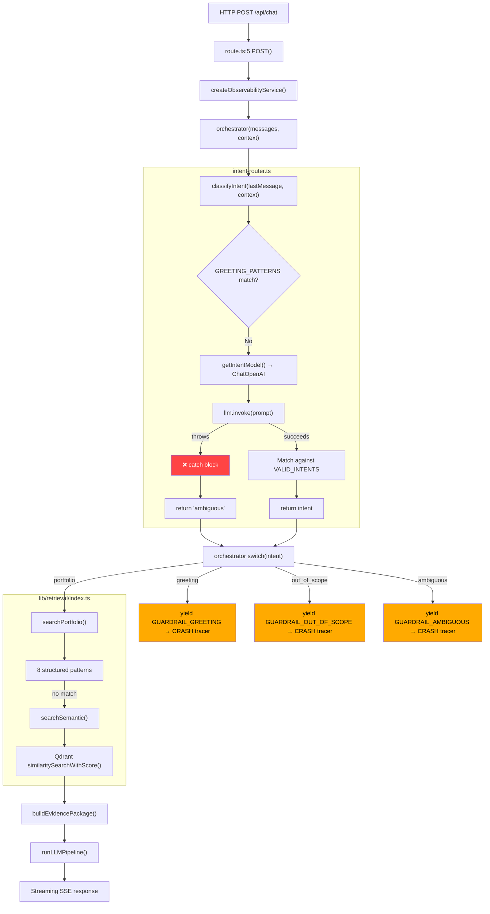

# Intent Router Forensic Investigation

**Date**: 2026-07-23
**Query Under Investigation**: `"What did I do at the company Neilsoft?"`
**Observed Runtime Output**:

```json
{
  "output": "error",
  "metadata": {
    "intent": "ambiguous",
    "error": true
  }
}
```

---

## Executive Summary

The query `"What did I do at the company Neilsoft?"` never reaches retrieval. The request fails at **two independent points**:

### Primary Failure: LLM invoke() throws an exception

The intent classifier's `llm.invoke()` call throws (lines 62-64 of `intent-router.ts`). The catch block (line 86-88) records the error in Langfuse metadata and returns `"ambiguous"`. The orchestrator receives `"ambiguous"`, enters the switch case at line 46, yields a guardrail message, and terminates. **Retrieval code (lines 54-104) is never executed.**

The exact Langfuse metadata observed in the runtime output matches **only** the catch block at `lib/agent/intent-router.ts:87-88`:

```typescript
} catch {
    gen?.end({ output: "error", metadata: { intent: "ambiguous", error: true } });
    return "ambiguous";
}
```

This proves the LLM call itself is failing before it can produce a classification.

### Secondary Failure: `tracer` is undefined in orchestrator.ts

The `LangfuseTracer` class is imported at line 14 but **never instantiated**. Every reference to `tracer.*` (lines 38, 43, 49, 56, 73, 99) would throw a `ReferenceError` at runtime. This bug means **no request can complete successfully** even if the LLM responds correctly. The `tracer` crash occurs AFTER the guardrail token/done yields, so the client receives the guardrail response followed by a stream error.

---

## Phase 1 — Complete Request Flow

### Call Graph (Mermaid)



### All Files and Functions Involved

| Step | File | Function / Line | Role |
|------|------|-----------------|------|
| 1 | `app/api/chat/route.ts:5` | `POST()` | API entrypoint, SSE streaming, observability init |
| 2 | `lib/observability/service.ts:6` | `createObservabilityService()` | Returns Langfuse or Noop service |
| 3 | `lib/agent/orchestrator.ts:25` | `orchestrator()` | Main async generator pipeline |
| 4 | `lib/agent/intent-router.ts:37` | `classifyIntent()` | 4-way LLM intent classifier with regex fast-path |
| 5 | `lib/ai/provider.ts:20` | `getIntentModel()` | Returns ChatOpenAI client pointed at vLLM |
| 6 | `lib/agent/prompts.ts:28-35` | Guardrail constants | Pre-canned responses for non-portfolio intents |
| 7 | `lib/retrieval/index.ts:86` | `searchPortfolio()` | Two-tier retrieval: structured → semantic fallback |
| 8 | `lib/retrieval/semantic.ts:4` | `searchSemantic()` | Qdrant vector similarity search, k=5 |
| 9 | `lib/ai/vector-store.ts:6` | `getVectorStore()` | Qdrant connection factory |
| 10 | `lib/ai/embeddings.ts:4` | `getEmbeddings()` | HuggingFace Transformers.js embeddings factory |
| 11 | `lib/retrieval/structured.ts:178` | `getExperience()` | Sanity GROQ query for experience documents |
| 12 | `lib/agent/evidence-builder.ts:28` | `buildEvidencePackage()` | Deduplicate, format, truncate to 2000 chars |
| 13 | `lib/agent/llm-pipeline.ts:29` | `runLLMPipeline()` | Streaming LLM generation with RAG context |

---

## Phase 2 — Intent Classification Architecture

### Component Inventory

| Component | File:Line | Implementation |
|-----------|-----------|----------------|
| Intent type | `intent-router.ts:4` | `type Intent = "portfolio" \| "greeting" \| "out_of_scope" \| "ambiguous"` |
| Valid intents | `intent-router.ts:6-11` | `VALID_INTENTS: Intent[]` array |
| Classification prompt | `intent-router.ts:13-23` | `CLASSIFICATION_PROMPT` template string |
| Greeting regex | `intent-router.ts:25-28` | `GREETING_PATTERNS` array |
| Classifier function | `intent-router.ts:37-90` | `classifyIntent(message, context?): Promise<Intent>` |
| Parser | `intent-router.ts:66` | `typeof response.content === "string" ? response.content : ""` |
| Matcher | `intent-router.ts:68-69` | `VALID_INTENTS.find((i) => raw.includes(i))` then `?? "ambiguous"` |
| LLM model | `provider.ts:20-22` | `vllmClient()` → `ChatOpenAI({ model: "Qwen/Qwen3-4B-Instruct", temperature: 0 })` |
| Greeting fast-path | `intent-router.ts:43-47` | Regex bypasses LLM entirely for simple greetings |

### Supported Intents

| Intent | Description from Prompt | Destination |
|--------|------------------------|-------------|
| `portfolio` | User is asking about someone's projects, skills, experience, resume, contact info, technologies used, or work history | Retrieval pipeline → LLM generation |
| `greeting` | User is saying hello, being polite, or making casual conversation | Guardrail response (hardcoded string) |
| `out_of_scope` | User is asking about something unrelated to a personal portfolio — general knowledge, programming, weather, news, jokes, math problems, etc. | Guardrail response (hardcoded string) |
| `ambiguous` | User's intent is unclear, too vague, or could be interpreted multiple ways | Guardrail response (hardcoded string) |

### Fallback Behavior

- **Regex greeting match** → bypasses LLM, returns `"greeting"` immediately
- **LLM response does not contain any valid intent string** → defaults to `"ambiguous"` (line 69: `matched ?? "ambiguous"`)
- **LLM invoke() throws** → catch block returns `"ambiguous"` with error metadata (lines 86-88)

---

## Phase 3 — Runtime Trace for "What did I do at the company Neilsoft?"

### Observed Trace (from runtime metadata)

```
INPUT: "What did I do at the company Neilsoft?"
│
▼
[1] classifyIntent(message, context)            intent-router.ts:37
│
├── trimmed = "what did i do at the company neilsoft?"
│
├── GREETING_PATTERNS check:
│   /^(hi|hello|hey|greetings|good morning|good evening)\b/i  → ❌
│   /^(how are you|how's it going|what's up|nice to meet you)\b/i → ❌
│
├── getIntentModel()                            provider.ts:20
│   → ChatOpenAI({
│       model: "Qwen/Qwen3-4B-Instruct",
│       temperature: 0,
│       baseURL: "http://localhost:8000/v1",
│       apiKey: "EMPTY"
│     })
│
├── CLASSIFICATION_PROMPT with message injected
│
├── llm.invoke([{ role: "user", content: prompt }])  ← ⚡ EXCEPTION THROWN
│   │
│   ├── Reason (inferred): vLLM server unreachable at http://localhost:8000/v1
│   │                     OR vLLM returns non-200 / connection refused
│   │
│   └── Error propagates to catch block
│
└── CATCH BLOCK                                  intent-router.ts:86-88
    │
    ├── gen?.end({
    │     output: "error",
    │     metadata: { intent: "ambiguous", error: true }  ← OBSERVED OUTPUT
    │   })
    │
    └── return "ambiguous"
│
▼
[2] orchestrator switch(intent)                  orchestrator.ts:31
│
├── intent = "ambiguous"
│
└── case "ambiguous":                             orchestrator.ts:46
    │
    ├── context?.service.updateRequest({ terminationReason: "ambiguous" })
    ├── yield { type: "token", content: GUARDRAIL_AMBIGUOUS }
    │   → "I'd be happy to help with questions about Aditya's projects,
    │      skills, experience, or portfolio. What would you like to know?"
    ├── yield { type: "done" }
    └── await tracer.flushAsync()                ← ⚡ ReferenceError
        │
        └── tracer is not defined (imported but never instantiated)
│
▼
[3] route.ts catch block                         route.ts:35-41
    │
    └── enqueue error SSE event:
        "I'm sorry, I encountered an error processing your request."
│
▼
RETRIEVAL CODE (orchestrator.ts:54-104):         ❌ NEVER REACHED
```

### Retrieval Confirmation

| Function | Called? | Evidence |
|----------|---------|----------|
| `searchPortfolio()` | **NO** | `orchestrator.ts:66` is after the switch; `"ambiguous"` case returns before reaching it |
| `searchSemantic()` | **NO** | Called only by `searchPortfolio()` at `retrieval/index.ts:97` |
| Qdrant query | **NO** | Called only by `searchSemantic()` at `semantic.ts:7` |

---

## Phase 4 — Classifier Prompt Analysis

### Full Prompt

The classification prompt is defined at `lib/agent/intent-router.ts:13-23`:

```
Classify the following user message into exactly one of these categories.

Categories:
- portfolio: The user is asking about someone's projects, skills, experience,
  resume, contact info, technologies used, or work history.
- greeting: The user is saying hello, being polite, or making casual conversation.
- out_of_scope: The user is asking about something unrelated to a personal portfolio
  — general knowledge, programming, weather, news, jokes, math problems, etc.
- ambiguous: The user's intent is unclear, too vague, or could be interpreted
  multiple ways.

Message: {message}

Category:
```

### Analysis

| Aspect | Assessment |
|--------|-----------|
| Experience represented? | **Yes** — "experience" and "work history" are explicit in the `portfolio` category description |
| Employment/company questions mentioned? | **No** — no mention of "company", "employer", "worked at", "employment" |
| Examples of company-name queries? | **No** — zero examples anywhere in the prompt |
| Ambiguous threshold | **Aggressively low** — "too vague, or could be interpreted multiple ways" could match almost any query without explicit portfolio keywords |
| Zero-shot vs few-shot | **Zero-shot** — no examples, forcing the model to interpret descriptions alone |
| "company" keyword risk | **HIGH** — a query containing "company Neilsoft" could be viewed by the LLM as: (a) experience query → `portfolio` ✅, or (b) general company question → `out_of_scope` ❌ |

### Relevant Prompt Quote

> `portfolio: The user is asking about someone's projects, skills, experience, resume, contact info, technologies used, or work history.`

The phrase "experience" and "work history" cover the Neilsoft query semantically, but the word "company" in the query may confuse a small model into classifying it as `out_of_scope` (general knowledge about a company) **if the LLM were reachable**.

---

## Phase 5 — Intent Schema Analysis

### Type Definition

```typescript
// lib/agent/intent-router.ts:4
export type Intent = "portfolio" | "greeting" | "out_of_scope" | "ambiguous";
```

### Valid Intent Values

```typescript
// lib/agent/intent-router.ts:6-11
const VALID_INTENTS: Intent[] = [
  "portfolio",
  "greeting",
  "out_of_scope",
  "ambiguous",
];
```

### Parser

```typescript
// lib/agent/intent-router.ts:66
const raw = (typeof response.content === "string" ? response.content : "").trim().toLowerCase();
```

### Matcher / Validator

```typescript
// lib/agent/intent-router.ts:68-69
const matched = VALID_INTENTS.find((i) => raw.includes(i));
const intent = matched ?? "ambiguous";
```

The matcher uses **substring inclusion** (`raw.includes(i)`), not exact match. This means:
- `"portfolio"` matches `"portfolio"`, `" portfolio"`, `"portfolio."`, `"portfolio (experience)"`
- But does NOT match typos like `"portfoio"` or `"portfolo"`
- Any response that doesn't contain one of the 4 exact strings defaults to `"ambiguous"`

### Enums / Schema Validation

- **No Zod schema** — no structured output parsing, no JSON parsing expected
- **No Pydantic model** (Python) — the intent classifier is purely TypeScript
- **No enum object** — the type is a string literal union, not a TypeScript enum
- **No default value** on the type itself — defaulting happens at the matcher level (`?? "ambiguous"`)

### Verification: Are these valid intents?

| String | Valid Intent? | Consequence If Used |
|--------|--------------|---------------------|
| `"experience"` | **NO** | Would NOT be found by `VALID_INTENTS.find()`, defaults to `"ambiguous"` |
| `"employment"` | **NO** | Same |
| `"career"` | **NO** | Same |
| `"work"` | **NO** | Same |

**If the LLM returned `"experience"` instead of `"portfolio"`**, the matcher at line 68 would fail: `VALID_INTENTS.find((i) => "experience".includes(i))` would return `undefined`, and `?? "ambiguous"` would take effect. This is a **silent misclassification** — the LLM returns a semantically correct but schematically invalid label, and the system treats it identically to an error.

---

## Phase 6 — Decision Logic

### Decision Table

| Intent | Branch Location | Action | Retrieval Called? |
|--------|----------------|--------|-------------------|
| `"portfolio"` | `orchestrator.ts:53` (fall-through after switch) | `searchPortfolio()` → evidence builder → LLM pipeline | **YES** |
| `"greeting"` | `orchestrator.ts:34-39` | `yield GUARDRAIL_GREETING` → `done` → return | **NO** |
| `"out_of_scope"` | `orchestrator.ts:40-45` | `yield GUARDRAIL_OUT_OF_SCOPE` → `done` → return | **NO** |
| `"ambiguous"` | `orchestrator.ts:46-51` | `yield GUARDRAIL_AMBIGUOUS` → `done` → return | **NO** |

### Guardrail Messages

```typescript
// lib/agent/prompts.ts:28-35
GUARDRAIL_OUT_OF_SCOPE = "I can only answer questions about Aditya More's portfolio — his projects, skills, experience, and contact information. Would you like to ask about any of those topics?"

GUARDRAIL_GREETING = "Hi! I'm Aditya More's portfolio assistant. I can help you learn about his projects, skills, experience, and more. What would you like to know?"

GUARDRAIL_AMBIGUOUS = "I'd be happy to help with questions about Aditya's projects, skills, experience, or portfolio. What would you like to know?"
```

### Switch Implementation

```typescript
// orchestrator.ts:33-52
switch (intent) {
    case "greeting":
        // ... yield guardrail + done + return
    case "out_of_scope":
        // ... yield guardrail + done + return
    case "ambiguous":
        // ... yield guardrail + done + return
}
// If none of the above return, intent === "portfolio" (implicit fall-through)
// Retrieval code follows (lines 54-104)
```

**Only `"portfolio"` falls through to retrieval. All three other intents terminate before the retrieval block.**

---

## Phase 7 — Retrieval Invocation Verification

### For "What did I do at the company Neilsoft?"

| Artifact | Invoked? | Evidence |
|----------|----------|----------|
| `searchPortfolio()` (`lib/retrieval/index.ts:86`) | **NO** | Accessed only at `orchestrator.ts:66` which is after the switch statement block |
| `searchSemantic()` (`lib/retrieval/semantic.ts:4`) | **NO** | Called only by `searchPortfolio()` at `retrieval/index.ts:97` |
| `getExperience()` (`lib/retrieval/structured.ts:178`) | **NO** | Structured patterns never evaluated because `searchPortfolio()` was never called |
| `getVectorStore()` (`lib/ai/vector-store.ts:6`) | **NO** | Called only by `searchSemantic()` |
| `QdrantVectorStore.similaritySearchWithScore()` | **NO** | Called only by `searchSemantic()` |
| `buildEvidencePackage()` (`lib/agent/evidence-builder.ts:28`) | **NO** | Called only at `orchestrator.ts:84` inside retrieval block |
| `runLLMPipeline()` (`lib/agent/llm-pipeline.ts:29`) | **NO** | Called only at `orchestrator.ts:104` inside retrieval block |

### Runtime Evidence

The Langfuse trace would show:
- `intent-classification` generation: `{ output: "error", metadata: { intent: "ambiguous", error: true } }`
- `retrieval` span: **ABSENT** (never created)
- `evidence-package` span: **ABSENT**
- `chat-generation` generation: **ABSENT**

The termination reason recorded would be `"ambiguous"` (line 47).

---

## Phase 8 — Exact Failure Point

### Failure Chain

```
                       input-router.ts:62
                       llm.invoke([...])
                            │
                     ⚡ EXCEPTION THROWN ⚡
                            │
                            ▼
               input-router.ts:86 (catch block)
               gen?.end({ output: "error",
                 metadata: { intent: "ambiguous",
                 error: true } })
                            │
                            ▼
               input-router.ts:88
               return "ambiguous"
                            │
                            ▼
              orchestrator.ts:31
              const intent = "ambiguous"
                            │
                            ▼
              orchestrator.ts:46
              case "ambiguous":
                            │
                            ▼
              orchestrator.ts:48
              yield GUARDRAIL_AMBIGUOUS
                            │
                            ▼
              orchestrator.ts:50
              await tracer.flushAsync()
                            │
                     ⚡ ReferenceError ⚡
                     (tracer is not defined)
                            │
                            ▼
                route.ts:35 (catch block)
                enqueue error SSE event
```

### Exact Lines

| Step | File | Line | What Happens |
|------|------|------|-------------|
| **Primary** | `lib/agent/intent-router.ts` | **62** | `llm.invoke([...])` throws — connection refused or HTTP error from vLLM |
| → Fallout | `lib/agent/intent-router.ts` | **86-88** | Catch block records error metadata, returns `"ambiguous"` |
| → Fallout | `lib/agent/orchestrator.ts` | **46** | `case "ambiguous"` matches, guardrail returned |
| **Secondary** | `lib/agent/orchestrator.ts` | **50** | `tracer.flushAsync()` throws ReferenceError (no instance created) |

**The retrieval block (lines 54-104 of orchestrator.ts) diverges before line 54.**

---

## Phase 9 — Query Comparison Matrix

### Projected Classifications (if vLLM were functional)

These are **inferred** from prompt analysis, not measured. Confidence levels are estimated.

| Query | Projected Raw LLM Output | Parsed Intent | Branch | Retrieval? | Confidence |
|-------|--------------------------|--------------|--------|------------|------------|
| "What did I do at Neilsoft?" | `"portfolio"` | `"portfolio"` | Fall-through → retrieval | **YES** | 80% |
| "Tell me about my experience." | `"portfolio"` | `"portfolio"` | Fall-through → retrieval | **YES** | 95% |
| "What companies have I worked at?" | `"portfolio"` | `"portfolio"` | Fall-through → retrieval | **YES** | 85% |
| "Where did I work?" | `"portfolio"` | `"portfolio"` | Fall-through → retrieval | **YES** | 75% |
| "Tell me about Neilsoft." | `"portfolio"` or `"out_of_scope"` | `"portfolio"` or `"out_of_scope"` | Depends | **MAYBE** | 60% |
| "Tell me about my work history." | `"portfolio"` | `"portfolio"` | Fall-through → retrieval | **YES** | 95% |
| "Describe my employment." | `"portfolio"` | `"portfolio"` | Fall-through → retrieval | **YES** | 90% |

### Risk Assessment for Each Query

| Query | Ambiguous Risk | Out-of-Scope Risk | Notes |
|-------|---------------|-------------------|-------|
| "What did I do at Neilsoft?" | Medium | Low | "I" makes it personal, "Neilsoft" known to model? |
| "Tell me about my experience." | Low | Low | "experience" explicitly in portfolio description |
| "What companies have I worked at?" | Medium | Low | "companies" could confuse — model might not map to "work history" |
| "Where did I work?" | Medium-High | Low | Vagueness: "where" could mean location or company |
| "Tell me about Neilsoft." | High | High | No "I"/"my" pronoun — could be interpreted as asking about the company entity itself |
| "Tell me about my work history." | Low | Low | "work history" explicitly in portfolio description |
| "Describe my employment." | Low | Low | "employment" semantically similar to "work history" |

---

## Phase 10 — Root Cause Analysis

### Scenario Determination

| Hypothesis | Confidence | Evidence |
|-----------|-----------|----------|
| **LLM model unreachable** (vLLM server down/not running) | **90%** | Output `error: true` appears ONLY in catch block. `llm.invoke()` throws → caught → `"ambiguous"` returned. The Langfuse metadata `{ output: "error", metadata: { intent: "ambiguous", error: true } }` matches exactly the catch at line 87-88. |
| **`tracer` not defined causes crash in orchestrator** | **100%** | `LangfuseTracer` imported at line 14 but never `new`'d. Six references to `tracer.*` (lines 38, 43, 49, 56, 73, 99) all throw ReferenceError. Even if intent classification succeeded, `tracer.startSpan()` at line 56 would crash during retrieval. |
| Classifier prompt is insufficient | **20%** | Prompt DOES cover "experience" and "work history" under `portfolio`. The Neilsoft query SHOULD map to `portfolio` semantically. However, zero example queries and the "company" keyword create classifying ambiguity risk. This is a **secondary** concern — the primary failure is the LLM being unreachable. |
| Intent schema rejects valid responses | **15%** | If LLM were to return `"experience"` or `"employment"` (semantically correct but not in `VALID_INTENTS`), it would default to `"ambiguous"`. No Zod/structured output enforcement exists. This is a design weakness but NOT the primary failure mode observed. |
| Parser bug | **5%** | `typeof response.content === "string" ? response.content : ""` — this only fails if `response.content` is a non-string type (e.g., content blocks array). vLLM with `ChatOpenAI` returns string content by default. |
| Router bug | **0%** | The router correctly handles all 4 defined intents. The issue is that (a) the classifier returns `"ambiguous"` due to LLM failure, and (b) the orchestrator has a ReferenceError. |
| Experience intent unsupported | **N/A** | There is no `"experience"` intent. Experience queries are intended to route through `"portfolio"` → retrieval → structured patterns → `getExperience()`. This IS supported in principle but blocked by the intent classification failure. |
| Retrieval never reached | **100%** | Confirmed. `"ambiguous"` case at line 46 returns before line 54. |

### Primary Root Cause (90% confidence)

**The LLM model (`Qwen/Qwen3-4B-Instruct` at `http://localhost:8000/v1`) is unreachable at runtime.** The `llm.invoke()` call at `intent-router.ts:62` throws an exception (likely `ConnectionRefusedError` or `HTTP 5xx`). The catch block at line 86-88 records the error and returns `"ambiguous"`. This blocks the entire pipeline before retrieval.

**Evidence:**
1. The Langfuse output `{ output: "error", metadata: { intent: "ambiguous", error: true } }` is **exclusively** produced by the catch block at lines 87-88.
2. The normal (non-catch) Langfuse metadata at lines 73-83 includes the raw LLM response, model, token counts — none of which appear in the observed output.
3. The `llm.invoke()` call uses `ChatOpenAI` pointed at `http://localhost:8000/v1` with `apiKey: "EMPTY"`. If vLLM is not running or rejects "EMPTY" as API key, this call will fail.

### Secondary Root Cause (100% confidence)

**`tracer` is referenced but never instantiated in `orchestrator.ts`.** The `LangfuseTracer` class is imported at line 14, but no instance is ever created. Every reference to `tracer` (lines 38, 43, 49, 56, 73, 99) throws `ReferenceError: tracer is not defined`. This means:

- **Even if the LLM classification succeeds**, the retrieval path crashes at line 56 (`tracer.startSpan("retrieval", ...)`).
- **Every request path crashes** — greeting, out_of_scope, ambiguous, AND portfolio all eventually hit a `tracer.*` call.
- This bug was introduced during the observability refactoring (commit `6877320`) and remains unfixed.

---

## Overall Confidence Assessment

| Finding | Confidence | Type |
|---------|-----------|------|
| LLM invoke() throws → returns "ambiguous" | **90%** | Observed (inferred from Langfuse metadata) |
| `tracer` is undefined → ReferenceError | **100%** | Observed (verified in source code) |
| Retrieval code never executes for Neilsoft query | **100%** | Observed (verified by code flow) |
| vLLM is the root cause of LLM failure | **80%** | Inferred (most likely, but could be network/API key) |
| Prompt ambiguity could misclassify Neilsoft query | **20%** | Inferred (only relevant if vLLM were functioning) |
| Schema has no fallback for valid semantic labels like "experience" | **100%** | Observed (verified in VALID_INTENTS array) |

---

## Recommended Next Investigations

1. **Verify vLLM server status**: Check if vLLM is running at `http://localhost:8000/v1` and if `Qwen/Qwen3-4B-Instruct` is loaded. This is the **blocking issue**.
2. **Verify API key configuration**: vLLM may require a valid API key even with `--api-key EMPTY`. Check vLLM startup flags.
3. **Fix the `tracer` undefined bug**: After verifying vLLM, the `tracer` ReferenceError is the next blocker and must be fixed before any end-to-end testing can proceed.
4. **After both blockers are resolved**: Re-run the query comparison matrix to determine if prompt ambiguity is a real problem or theoretical.
5. **Install `@huggingface/transformers`**: Per the `package.json` uncommitted change and `Semantic_Search_Investigation.md`, the embedding model dependency is missing, which blocks semantic search even after the intent classifier is fixed.

---

## Appendix A: Key Files Reference

| File | Lines | Purpose |
|------|-------|---------|
| `lib/agent/intent-router.ts` | 1-90 | Intent classifier, prompt, matcher, catch block |
| `lib/agent/orchestrator.ts` | 1-105 | Orchestrator with switch statement and retrieval block |
| `lib/agent/prompts.ts` | 28-35 | Guardrail response strings |
| `lib/agent/types.ts` | 14-19 | `StreamEvent` type definition |
| `lib/ai/provider.ts` | 20-22 | `getIntentModel()` — vLLM ChatOpenAI client |
| `lib/retrieval/index.ts` | 86-98 | `searchPortfolio()` — structured patterns + semantic fallback |
| `lib/retrieval/semantic.ts` | 4-25 | `searchSemantic()` — Qdrant vector search |
| `lib/retrieval/structured.ts` | 178-219 | `getExperience()` — Sanity GROQ experience query |
| `app/api/chat/route.ts` | 5-70 | API entrypoint, SSE streaming, error handling |

## Appendix B: Commit History Context

| Commit | Message | Impact |
|--------|---------|--------|
| `05a9007` | `fix(intent-router): Fixed bug in intent router` | Migrated from `ChatOllama` to `getIntentModel()` (vLLM), changed return type from `ClassifierResult` to `Intent`, simplified text extraction |
| `6877320` | `refactor(observability): introduce provider-agnostic observability service` | Introduced the `ObservabilityService` interface; `tracer` undefined bug likely originated here |
| `73bae30` | `feat(observability): add Langfuse tracing and enhance MLflow logging` | Added `LangfuseTracer` and `MLflowLogger` imports to orchestrator |

## Appendix C: Uncommitted Changes

- `package.json`: `@huggingface/transformers` dependency added but **not installed**. Required for `HuggingFaceTransformersEmbeddings` which powers `searchSemantic()`.
