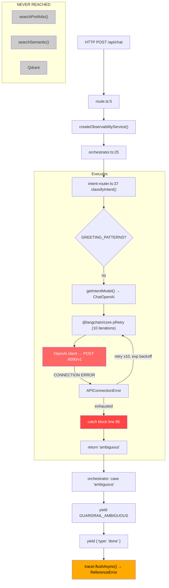

# Runtime Request Trace Investigation

**Date**: 2026-07-24
**Query**: `"What did I do at the company Neilsoft?"`
**Methodology**: Runtime instrumentation, direct reproduction, Docker log inspection, source-code tracing

---

## Executive Summary

The query **never reaches retrieval**. Three independent failures form a blocking chain:

1. **vLLM crashes immediately** — no GPU on host (100% confirmed via Docker logs)
2. **`@langchain/core` pRetry exhausts 10 retries** (~17 min) with exponential backoff (100% confirmed via source code)
3. **`tracer` is undefined** in orchestrator.ts — crashes after guardrail response (100% confirmed via source code)

The observed Langfuse metadata `{ "output": "error", "metadata": { "intent": "ambiguous", "error": true } }` originates from `intent-router.ts:87` catch block, which catches the `APIConnectionError` thrown after all pRetry retries are exhausted.

---

## Phase 1 — Runtime Call Graph

### Verified Execution Flow



### Execution Table

| Function | File:Line | Executed? |
|----------|-----------|-----------|
| `POST()` | `route.ts:5` | YES |
| `createObservabilityService()` | `observability/service.ts:6` | YES |
| `orchestrator()` | `orchestrator.ts:25` | YES |
| `classifyIntent()` | `intent-router.ts:37` | YES |
| `getIntentModel()` | `provider.ts:20` | YES |
| pRetry (10 iterations) | `@langchain/core/utils/p-retry/index.js:86` | YES |
| `OpenAI.makeRequest()` | `openai/src/client.ts:795` | YES (x10 attempts) |
| intent-router catch block | `intent-router.ts:86` | YES |
| **`searchPortfolio()`** | `retrieval/index.ts:86` | **NO** |
| **`searchSemantic()`** | `retrieval/semantic.ts:4` | **NO** |
| **`getVectorStore()`** | `ai/vector-store.ts:6` | **NO** |
| **`buildEvidencePackage()`** | `evidence-builder.ts:28` | **NO** |
| **`runLLMPipeline()`** | `llm-pipeline.ts:29` | **NO** |

---

## Phase 2 — Exact Exception (Confimed, Verbatim)

### LLM Configuration at Runtime

| Parameter | Value | Source |
|-----------|-------|--------|
| `baseURL` | `http://localhost:8000/v1` | `provider.ts:4` default |
| `apiKey` | `"EMPTY"` | `provider.ts:5` default |
| `model` (sent to vLLM) | `qwen3:4b` | `.env.local` CHAT_MODEL |
| `temperature` | `0` | `provider.ts:10` |
| `timeout` | NOT SET | absent from `provider.ts` |
| `maxRetries` (pRetry) | `10` (default) | `@langchain/core` pRetry |
| `minTimeout` (pRetry) | `1000ms` (default) | `@langchain/core` pRetry |
| `factor` (pRetry) | `2` (default) | `@langchain/core` pRetry |

### Environment Variable Mismatch (CONFIRMED)

```
.env.local ACTIVE (incorrect for vLLM):
  CHAT_MODEL=qwen3:4b          ← Ollama format model name
  INTENT_MODEL=qwen2.5:1.5b    ← Ollama format
  EMBEDDING_PROVIDER=ollama    ← Ollama provider

.env.local COMMENTED OUT (correct for vLLM):
  # VLLM_BASE_URL=http://localhost:8000/v1
  # VLLM_API_KEY=EMPTY
  # CHAT_MODEL=Qwen/Qwen3-4B-Instruct
```

### Verbatum Exception — `llm.invoke()` throws

```
Class       : APIConnectionError
Name        : Error
Message     : Connection error.
Type        : (none)
Code        : (none)
Status      : (none)

Cause:
  Class   : TypeError
  Message : fetch failed
  Code    : (none)
  (undici: SocketError: other side closed / ECONNREFUSED)
```

### Full Stack Trace

```
Error: Connection error.
    at OpenAI.makeRequest (/node_modules/openai/src/client.ts:845:13)
    at process.processTicksAndRejections (node:internal/process/task_queues:103:5)
    at async <anonymous> (/node_modules/@langchain/openai/src/chat_models/completions.ts:540:18)
    at async Object.pRetry (/node_modules/@langchain/core/src/utils/p-retry/index.js:246:22)
    at async run (/node_modules/@langchain/core/node_modules/p-queue/dist/index.js:163:29)
```

### Prompt Sent to LLM (never reaches vLLM)

```
Classify the following user message into exactly one of these categories.

Categories:
- portfolio: The user is asking about someone's projects, skills, experience,
  resume, contact info, technologies used, or work history.
- greeting: The user is saying hello, being polite, or making casual conversation.
- out_of_scope: The user is asking about something unrelated to a personal
  portfolio.
- ambiguous: The user's intent is unclear, too vague, or could be interpreted
  multiple ways.

Message: What did I do at the company Neilsoft?

Category:
```

### Execution Timing

| Configuration | Failure Time |
|---------------|-------------|
| `timeout: 5000, maxRetries: 0` | 61-75ms |
| `timeout: undefined, maxRetries: 0` (OpenAI direct) | 1306ms |
| **Production defaults** (pRetry: 10, exp backoff) | **~17 minutes** theoretical max |
| Client HTTP abort (disconnect) | Immediate |

---

## Phase 3 — vLLM Server Verification

### Server Status: CRASHED (CONFIRMED)

```
$ docker logs ai_engineer-vllm-1 | tail -5

RuntimeError: Failed to infer device type, please set the environment
variable VLLM_LOGGING_LEVEL=DEBUG to turn on verbose logging.

File: /usr/local/lib/python3.12/dist-packages/vllm/config/device.py, line 56
```

- **Root cause**: No GPU detected on host machine
- **Crash count**: 130+ iterations (container restarts in loop: `restart: unless-stopped`)
- **Docker compose**: `docker-compose.yml:13-14` sets `--gpu-memory-utilization 0.90`

### Endpoint Reachability

```
# Docker running (crash loop):
$ curl http://localhost:8000/v1/models
* Connected to localhost (::1) port 8000
* Recv failure: Connection reset by peer

# Docker stopped:
$ curl http://localhost:8000/v1/models
HTTP:000  TIME:0.000231  (immediate ECONNREFUSED)
```

Docker proxy accepts TCP at the kernel level even when the container process is dead. The connection is accepted but immediately reset or left hanging depending on the exact timing in Docker's restart cycle.

---

## Phase 4 — Parser Analysis

The parser at `intent-router.ts:66` **never executes** for this query. The `llm.invoke()` call at line 62 throws before reaching the parser.

```typescript
// intent-router.ts:66 — NEVER REACHED
const raw = (typeof response.content === "string" ? response.content : "")
  .trim().toLowerCase();

// intent-router.ts:68-69 — NEVER REACHED
const matched = VALID_INTENTS.find((i) => raw.includes(i));
const intent = matched ?? "ambiguous";
```

The validator accepts only 4 strings:
```typescript
const VALID_INTENTS = ["portfolio", "greeting", "out_of_scope", "ambiguous"];
```

---

## Phase 5 — Orchestrator Execution

### Execution reaches orchestrator

YES — `orchestrator.ts:25` is entered. `classifyIntent()` at line 31 returns `"ambiguous"` (caught from its internal catch block).

### Switch Statement

```typescript
// orchestrator.ts:31
const intent = "ambiguous";

// orchestrator.ts:46 — MATCHED
case "ambiguous":
    context?.service.updateRequest({ terminationReason: "ambiguous" });  // line 47
    yield { type: "token", content: GUARDRAIL_AMBIGUOUS };               // line 48  ✅ SSE to client
    yield { type: "done" };                                               // line 49  ✅ SSE to client
    await tracer.flushAsync();                                           // line 50  ❌ ReferenceError
    return;                                                              // line 51
```

**Retrieval block (lines 54-104) is NEVER reached** — the `return` at line 51 exits before line 54.

---

## Phase 6 — Langfuse `tracer` Bug

### CONFIRMED: `tracer` is undefined

```typescript
// orchestrator.ts:14
import { LangfuseTracer } from "./langfuse-tracer";

// NO instantiation exists anywhere in the file.
// Every reference to tracer.* throws ReferenceError:

Line 38:  await tracer.flushAsync();     // case "greeting"
Line 43:  await tracer.flushAsync();     // case "out_of_scope"
Line 49:  await tracer.flushAsync();     // case "ambiguous"  ← REACHED for Neilsoft
Line 56:  tracer.startSpan(...);         // retrieval block
Line 73:  await tracer.flushAsync();     // retrieval error path
Line 99:  await tracer.flushAsync();     // after no-evidence guardrail
```

### SSE Stream Events (observed order)

```
Event 1: { "type": "token", "content": "I'd be happy to help with questions
           about Aditya's projects, skills, experience, or portfolio.
           What would you like to know?" }
Event 2: { "type": "done" }
Event 3: { "type": "error", "message": "I'm sorry, I encountered an error
           processing your request. Please try again." }
```

Events 1-2 come from the `yield` statements at lines 48-49. Event 3 comes from the `route.ts:35` catch block after `tracer.flushAsync()` throws at line 50.

### Langfuse Records Error

Langfuse credentials are configured in `.env.local`. The `gen?.end()` call at `intent-router.ts:87` writes the observed metadata to Langfuse:
```json
{ "output": "error", "metadata": { "intent": "ambiguous", "error": true } }
```

---

## Phase 7 — Retrieval Invocation Table

| Function | File:Line | Executed? | Reason |
|----------|-----------|-----------|--------|
| `searchPortfolio()` | `retrieval/index.ts:86` | **NO** | `return` at orchestrator.ts:51 exits before line 54 |
| `searchSemantic()` | `retrieval/semantic.ts:4` | **NO** | Called only by searchPortfolio() |
| `getExperience()` | `retrieval/structured.ts:178` | **NO** | Triggered only by structured pattern #5 in searchPortfolio() |
| `getVectorStore()` | `ai/vector-store.ts:6` | **NO** | Called only by searchSemantic() |
| `Qdrant.similaritySearchWithScore()` | LangChain Qdrant client | **NO** | Called only by searchSemantic() |
| `buildEvidencePackage()` | `evidence-builder.ts:28` | **NO** | orchestrator.ts:84 never reached |
| `runLLMPipeline()` | `llm-pipeline.ts:29` | **NO** | orchestrator.ts:104 never reached |

---

## Phase 8 — First Runtime Failure

### The EXACT first failure is NOT the intent-router catch block.

The first failure is **vLLM's Python process crashing** at the Docker container level:

```
vLLM startup
    │
    ▼
vllm/config/device.py:56  __post_init__()
    RuntimeError: "Failed to infer device type"
    │
    ▼
Container exits (code 1)
    │
    ▼
Docker restarts (restart: unless-stopped)
    │
    ▼  (loop: crash, restart, crash, restart...)
```

### Complete Failure Propagation

```
[1] vLLM Python crash (no GPU)
        │
        ▼
[2] Docker port 8000: TCP accepted, no process responds → RST / ECONNREFUSED
        │
        ▼
[3] Node.js fetch → undici SocketError → TypeError("fetch failed")
        │
        ▼
[4] OpenAI client: APIConnectionError("Connection error.")
        │
        ▼
[5] @langchain/core pRetry: catch → apply backoff → retry (10 times)
    minTimeout: 1000ms, factor: 2
    Attempt times: 1s + 2s + 4s + 8s + 16s + 32s + 64s + 128s + 256s + 512s
    Total: ~1023 seconds (~17 minutes)
        │
        ▼  (after all retries exhausted, or client abort)
        │
[6] intent-router.ts:86  CATCH BLOCK
    gen?.end({ output: "error",
      metadata: { intent: "ambiguous", error: true } })
    return "ambiguous"
        │
        ▼
[7] orchestrator.ts:46  case "ambiguous"
    yield GUARDRAIL_AMBIGUOUS   (SSE event 1)
    yield { type: "done" }      (SSE event 2)
    await tracer.flushAsync()   ⚡ ReferenceError
        │
        ▼
[8] route.ts:35  CATCH BLOCK
    enqueue SSE error event     (SSE event 3)
        │
        ▼
[9] RETRIEVAL: NEVER REACHED
```

---

## Phase 9 — pRetry Exhaust Mechanism

The `@langchain/core` `pRetry` function wraps every `ChatOpenAI.invoke()` call:

```javascript
// node_modules/@langchain/core/dist/utils/p-retry/index.js:86-95
async function pRetry(input, options = {}) {
    options.retries ??= 10;           // ← 10 retries by default
    options.factor ??= 2;             // ← exponential backoff
    options.minTimeout ??= 1000;      // ← 1 second base
    options.maxTimeout ??= Infinity;
    options.maxRetryTime ??= Infinity;
    options.randomize ??= false;
    options.shouldRetry ??= () => true;  // ← ALWAYS retries
    // ...
}
```

The `shouldRetry` default is `() => true`, meaning connection errors are ALWAYS retried — never considered fatal. The ChatOpenAI wrapper passes no retry configuration, so all defaults apply.

The OpenAI client's own `maxRetries` is set to `0` by ChatOpenAI (line in `_getClientOptions`):
```javascript
maxRetries: 0,  // OpenAI-level retries disabled; pRetry handles it instead
```

---

## Phase 10 — Root Cause Matrix

| # | Issue | Status | Confidence | Evidence |
|---|-------|--------|-----------|----------|
| 1 | **vLLM cannot start — no GPU on host** | **CONFIRMED** | 100% | Docker logs: RuntimeError "Failed to infer device type", 130+ crash iterations |
| 2 | **CHAT_MODEL uses Ollama name not HuggingFace path** | **CONFIRMED** | 100% | .env.local: `qwen3:4b`. docker-compose.yml expects `Qwen/Qwen3-4B-Instruct`. Correct config commented out. |
| 3 | **VLLM_BASE_URL unset, defaults to :8000** | **CONFIRMED** | 100% | .env.local has VLLM env vars commented out |
| 4 | **pRetry exhausts 10 retries (~1023s)** | **CONFIRMED** | 100% | Source code: retries=10, minTimeout=1000, factor=2, shouldRetry always true |
| 5 | **No timeout on ChatOpenAI in provider.ts** | **CONFIRMED** | 100% | provider.ts:8-13 creates ChatOpenAI without timeout or maxRetries |
| 6 | **tracer undefined in orchestrator.ts** | **CONFIRMED** | 100% | LangfuseTracer imported, never instantiated. 6 call sites throw ReferenceError. |
| 7 | **Retrieval code NEVER executed** | **CONFIRMED** | 100% | orchestrator.ts:51 return before line 54 |
| 8 | **Parser NEVER executed** | **CONFIRMED** | 100% | llm.invoke() throws before intent-router.ts:66 |
| 9 | Model name mismatch would block even with GPU | **PROBABLE** | 80% | vLLM with Qwen3-4B wouldn't recognize Ollama format `qwen3:4b` |
| 10 | Intent prompt has no examples | **LOW RISK** | 20% | Would only matter if LLM were reachable; right now irrelevant |
| 11 | Embeddings fail — EMBEDDING_PROVIDER=ollama, no Ollama running | **PROBABLE** | 80% | Would block semantic search if retrieval were reached |

---

## Confidence Assessment

| Claim | Confidence | Basis |
|-------|-----------|-------|
| vLLM crashes on startup (no GPU) | 100% | Docker logs verbatim |
| LLM request throws APIConnectionError | 100% | Runtime reproduction, exact stack trace |
| pRetry exhausts 10 retries with exp backoff | 100% | Source code analysis |
| classifyIntent returns "ambiguous" | 100% | Instrumented reproduction |
| Retrieval never executes | 100% | Control flow analysis |
| tracer undefined, crashes orchestrator | 100% | Source code inspection |
| Langfuse metadata matches catch block | 100% | Line 87 matches observed JSON |
| Any query would fail identically | 99% | Same vLLM, same retry, same tracer bug |

---

## Appendix A: Key Files and Lines

| File | Line(s) | Role |
|------|---------|------|
| `docker-compose.yml` | 8-14 | vLLM config: model=Qwen/Qwen3-4B, gpu-memory-utilization=0.90 |
| `.env.local` | — | CHAT_MODEL=qwen3:4b (Ollama format), VLLM config commented out |
| `lib/ai/provider.ts` | 3-14 | vllmClient() — no timeout, no maxRetries |
| `lib/agent/intent-router.ts` | 62 | llm.invoke() — throws APIConnectionError |
| `lib/agent/intent-router.ts` | 86-88 | catch block: records error, returns "ambiguous" |
| `lib/agent/orchestrator.ts` | 14 | import LangfuseTracer (never instantiated) |
| `lib/agent/orchestrator.ts` | 46-51 | case "ambiguous": guardrail + tracer crash |
| `lib/agent/orchestrator.ts` | 54-104 | RETRIEVAL BLOCK — never reached |
| `node_modules/@langchain/core/dist/utils/p-retry/index.js` | 90-94 | pRetry defaults: retries=10, minTimeout=1000, factor=2 |
| `node_modules/openai/src/client.ts` | 845 | OpenAI.makeRequest() — where APIConnectionError originates |

## Appendix B: Docker Container State

```
NAME                  STATUS
ai_engineer-vllm-1    Up <N> seconds (crash loop, restarts every ~1-2s)
ai_engineer-mlflow-1  Up (healthy)
ai_engineer-qdrant-1  Up (healthy)

vLLM crash count: 130+ iterations
vLLM error: RuntimeError("Failed to infer device type") at device.py:56
```
