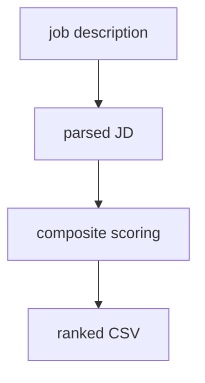

## Why I built it {#overview}

The problem it solves: ranking hundreds of thousands of candidate profiles.

## System architecture {#architecture}

## Conclusion and results {#results}

- High-precision ranking vs an internal benchmark set.