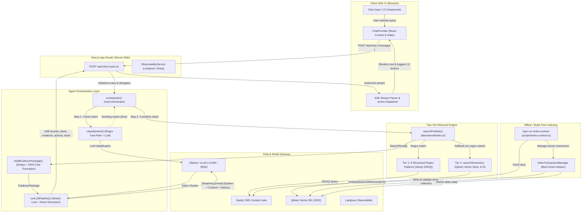
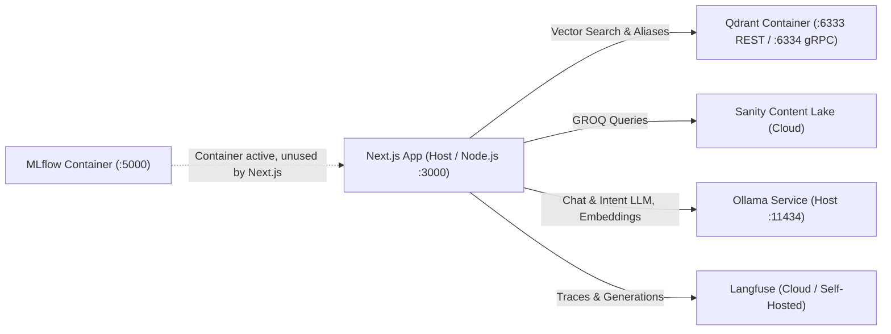

# Portfolio Assistant — Engineering Documentation

> **Status of Claims**: All statements in this document are explicitly marked as **[Verified]** (directly confirmed by codebase implementation and configuration), **[Strong inference]** (strongly supported by implementation logic/artifacts), or **[Unknown]** (unverifiable from repository alone).

---

## 1. What the System Does

The **Portfolio Assistant** is a grounded, retrieval-augmented conversational agent integrated into the Next.js portfolio website of Aditya More (Applied AI Engineer). It allows technical recruiters, engineering hiring managers, and visitors to ask natural-language questions about projects, technical skills, architecture decisions, professional experience, and contact information. **[Verified]**

Instead of relying on general LLM world knowledge or autonomous agent multi-step reasoning loops, the system enforces strict evidence grounding: it routes incoming queries through an intent classifier, executes a deterministic two-tier retrieval mechanism (structured Sanity GROQ patterns with fallback to Qdrant semantic vector search), injects only retrieved portfolio evidence into the prompt context, and streams responses to the UI via Server-Sent Events (SSE). If evidence is absent or incomplete, the assistant explicitly reports that the information was not found rather than hallucinating. **[Verified: [prompts.ts](file:///home/aditya/dev-work/projects/ai_engineer_portfolio/lib/agent/prompts.ts#L6-L13)]**

Additionally, the assistant extracts structured UI action tags from the model's output stream (such as `[openResume]`, `[openProject:slug]`, `[scrollTo:section]`, and `[navigate:url]`) to enable interactive frontend navigation directly from chat responses. **[Verified: [llm-pipeline.ts](file:///home/aditya/dev-work/projects/ai_engineer_portfolio/lib/agent/llm-pipeline.ts#L6-L27), [ChatProvider.tsx](file:///home/aditya/dev-work/projects/ai_engineer_portfolio/components/Chat/ChatProvider.tsx#L193-L220)]**

---

## 2. Architecture at a Glance

### High-Level Runtime & Indexing Flow



---

## 3. End-to-End Request Flow

When a user interacts with the chat assistant, the request follows a strictly sequenced, synchronous-like pipeline managed as an asynchronous generator yielding SSE events: **[Verified]**

```
User Query
  │
  ▼
1. ChatInput / ChatProvider (React)
  │  Creates user Message object, updates local React state
  │  Sends HTTP POST to `/api/chat` with full `messages` history
  ▼
2. app/api/chat/route.ts
  │  Validates request body (`messages` array non-empty)
  │  Instantiates `ObservabilityService` (Langfuse or Noop)
  │  Generates UUID `requestId` and opens `ReadableStream`
  ▼
3. lib/agent/orchestrator.ts — `orchestrator(messages, context)`
  │  Starts Langfuse trace `"chat-request"`
  │  Extracts `lastMessage = messages[messages.length - 1].content`
  ▼
4. lib/agent/intent-router.ts — `classifyIntent(lastMessage)`
  │  4a. Fast-path regex: Tests for greetings (`/^(hi|hello|hey...)/i`).
  │      → If matched: Returns `"greeting"` (takes < 1ms, no LLM call).
  │  4b. LLM classifier: Calls `getIntentModel()` with classification prompt.
  │      → Parses output into: `"portfolio"`, `"greeting"`, `"out_of_scope"`, or `"ambiguous"`.
  │      → If LLM fails/times out: Falls back safely to `"ambiguous"`.
  ▼
5. Orchestrator Intent Branching:
  ├── Case "greeting": Yields `GUARDRAIL_GREETING`, `done`, flushes trace, exits.
  ├── Case "out_of_scope": Yields `GUARDRAIL_OUT_OF_SCOPE`, `done`, flushes trace, exits.
  ├── Case "ambiguous": Yields `GUARDRAIL_AMBIGUOUS`, `done`, flushes trace, exits.
  └── Case "portfolio": Continues to Retrieval Layer.
  ▼
6. lib/retrieval/index.ts — `searchPortfolio(lastMessage)`
  │  6a. Tier 1 (Structured): Iterates 8 regex patterns in `STRUCTURED_PATTERNS`.
  │      If matched, executes direct Sanity GROQ query in `lib/retrieval/structured.ts`.
  │      If non-empty `SearchResult[]` returned, immediately uses these results.
  │  6b. Tier 2 (Semantic fallback): If no pattern matches or results are empty,
  │      calls `searchSemantic(lastMessage, k=5)` in `lib/retrieval/semantic.ts`.
  │      Generates query embedding via `getEmbeddings()` (Ollama / OpenAI),
  │      runs `vectorStore.similaritySearchWithScore(query, 5)` against Qdrant.
  ▼
7. lib/agent/evidence-builder.ts — `buildEvidencePackage(results)`
  │  Deduplicates search results by first 100 characters of content.
  │  Formats structured context: `"Project: ...\nSection: ...\nContent: ..."`.
  │  Truncates total context to `MAX_CONTEXT_CHARS = 2000` (appends truncation note if exceeded).
  │  If `evidencePackage.sources.length === 0`:
  │     Yields `"I couldn't find that information in Aditya's portfolio."`, `done`, and exits.
  ▼
8. lib/agent/llm-pipeline.ts — `runLLMPipeline(messages, evidencePackage, context)`
  │  Constructs LLM prompt messages:
  │    [0] System Prompt (`SYSTEM_PROMPT` with strict grounding rules)
  │    [1] System Message (`"Retrieved Portfolio Information:\n" + evidencePackage.context`)
  │    [2..N] Conversation history (last 10 messages from client: `messages.slice(-10)`)
  │  Invokes `ChatOpenAI.stream(llmMessages)` (temperature=0, timeout=180s).
  │  Yields `{ type: "token", content }` for each streamed token.
  │  Captures token usage metadata from stream.
  ▼
9. Action Extraction & Citation Dispatch:
  │  `extractActions(fullText)` parses tags: `[openResume]`, `[openProject:slug]`, `[scrollTo:section]`, `[navigate:url]`.
  │  Yields `{ type: "evidence", data: evidencePackage.sources }`.
  │  Yields `{ type: "actions", data: actions }`.
  │  Yields `{ type: "done" }`.
  ▼
10. UI Rendering & Client Action Execution (ChatProvider.tsx):
   Progressively renders text tokens into the message bubble.
   Attaches evidence citations to message state (viewable in SlideOutPanel).
   Executes detected actions (`window.open` for resume/project, `scrollIntoView` for sections).
```

---

## 4. Component Responsibilities

| Component | Responsibility | Implementation File | Main Runtime Path? |
| :--- | :--- | :--- | :--- |
| **Chat UI & Provider** | Manages client conversation state, renders message history, consumes SSE stream, dispatches UI navigation actions | [`components/Chat/ChatProvider.tsx`](file:///home/aditya/dev-work/projects/ai_engineer_portfolio/components/Chat/ChatProvider.tsx) | **Yes** |
| **Chat API Route Handler** | HTTP POST endpoint, validates payload, sets SSE headers, manages top-level request error handling and observability lifecycle | [`app/api/chat/route.ts`](file:///home/aditya/dev-work/projects/ai_engineer_portfolio/app/api/chat/route.ts) | **Yes** |
| **Agent Orchestrator** | Coordinates request lifecycle: intent classification, retrieval execution, evidence packaging, generation triggering, trace ending | [`lib/agent/orchestrator.ts`](file:///home/aditya/dev-work/projects/ai_engineer_portfolio/lib/agent/orchestrator.ts) | **Yes** |
| **Intent Router** | 2-layer classifier: Regex fast-path for greetings (1ms), LLM classifier for remaining queries into 4 discrete categories | [`lib/agent/intent-router.ts`](file:///home/aditya/dev-work/projects/ai_engineer_portfolio/lib/agent/intent-router.ts) | **Yes** |
| **Structured Retrieval** | Tier 1 retrieval: 8 regex patterns mapped to deterministic Sanity GROQ fetchers for skills, contact, experience, technology, and slugs | [`lib/retrieval/structured.ts`](file:///home/aditya/dev-work/projects/ai_engineer_portfolio/lib/retrieval/structured.ts), [`lib/retrieval/index.ts`](file:///home/aditya/dev-work/projects/ai_engineer_portfolio/lib/retrieval/index.ts) | **Yes** |
| **Semantic Retrieval** | Tier 2 retrieval: Fallback dense vector similarity search in Qdrant (`k=5`, cosine similarity) | [`lib/retrieval/semantic.ts`](file:///home/aditya/dev-work/projects/ai_engineer_portfolio/lib/retrieval/semantic.ts) | **Yes** |
| **AI Providers** | Factory methods instantiating LangChain wrappers (`ChatOpenAI`, `OllamaEmbeddings`, `QdrantVectorStore`) with fallback base URLs | [`lib/ai/provider.ts`](file:///home/aditya/dev-work/projects/ai_engineer_portfolio/lib/ai/provider.ts), [`lib/ai/embeddings.ts`](file:///home/aditya/dev-work/projects/ai_engineer_portfolio/lib/ai/embeddings.ts), [`lib/ai/vector-store.ts`](file:///home/aditya/dev-work/projects/ai_engineer_portfolio/lib/ai/vector-store.ts) | **Yes** |
| **Evidence Builder** | Pure function that deduplicates chunks by content prefix, formats context strings, and truncates to 2000 characters | [`lib/agent/evidence-builder.ts`](file:///home/aditya/dev-work/projects/ai_engineer_portfolio/lib/agent/evidence-builder.ts) | **Yes** |
| **LLM Pipeline** | Formats system prompt, context, and conversation history, invokes streaming LLM, extracts bracketed UI actions | [`lib/agent/llm-pipeline.ts`](file:///home/aditya/dev-work/projects/ai_engineer_portfolio/lib/agent/llm-pipeline.ts) | **Yes** |
| **Observability Service** | Interface-based request tracing, span timing, generation token logging, and flush timeout management (Langfuse & Noop) | [`lib/observability/service.ts`](file:///home/aditya/dev-work/projects/ai_engineer_portfolio/lib/observability/service.ts), [`lib/observability/langfuse.ts`](file:///home/aditya/dev-work/projects/ai_engineer_portfolio/lib/observability/langfuse.ts) | **Yes** |
| **LangfuseTracer** | Secondary standalone Langfuse wrapper class invoked directly inside `orchestrator.ts` | [`lib/agent/langfuse-tracer.ts`](file:///home/aditya/dev-work/projects/ai_engineer_portfolio/lib/agent/langfuse-tracer.ts) | **Yes** |
| **MLflow Logger** | Thin REST API wrapper for MLflow tracking | [`lib/agent/mlflow-logger.ts`](file:///home/aditya/dev-work/projects/ai_engineer_portfolio/lib/agent/mlflow-logger.ts) | **No** (Unused in runtime path) |
| **Transaction Index Manager** | Zero-downtime blue-green vector indexing: temporary collection build, semantic verification probes, atomic alias promotion | [`lib/indexing/transaction/manager.ts`](file:///home/aditya/dev-work/projects/ai_engineer_portfolio/lib/indexing/transaction/manager.ts) | **No** (Build/Offline time) |
| **Publishing Agent** | Python-based LangGraph CLI agent for managing Sanity document lifecycle via natural language | [`agent/publish_agent.py`](file:///home/aditya/dev-work/projects/ai_engineer_portfolio/agent/publish_agent.py) | **No** (Developer CLI tool) |

---

## 5. RAG Pipeline

### Ingestion & Indexing

1. **Trigger & Execution**: Ingestion is an **offline / build-time** CLI process executed via `npm run index-content` ([`scripts/index-content.ts`](file:///home/aditya/dev-work/projects/ai_engineer_portfolio/scripts/index-content.ts)). It is **never** executed at request time. **[Verified]**
2. **Data Sources**:
   - Primary: Sanity Content Lake via `client.fetch` querying `project`, `siteSettings`, `experience`, and `skillCategory` documents. **[Verified: [data-source.ts](file:///home/aditya/dev-work/projects/ai_engineer_portfolio/lib/indexing/data-source.ts#L28-L36)]**
   - Fallback: Hardcoded fallback objects in `sanity/fallbackContent.ts` if Sanity environment variables are missing. **[Verified: [data-source.ts](file:///home/aditya/dev-work/projects/ai_engineer_portfolio/lib/indexing/data-source.ts#L38-L47)]**
3. **Chunking Strategy** ([`lib/indexing/chunkers.ts`](file:///home/aditya/dev-work/projects/ai_engineer_portfolio/lib/indexing/chunkers.ts)):
   - **Deterministic, section-based chunking** (no arbitrary character/token splitters with overlap).
   - **Projects**: 1 chunk for `shortSummary`, 1 chunk per section in `project.sections[]` (e.g., The Problem, The Solution, Engineering Decisions), and 1 chunk for `technologies`.
   - **Site Settings**: Discrete chunks for `shortBio`, `aboutSummary`, `heroDescription`, `focusAreas`, and `contactDescription`.
   - **Experience**: Exactly **1 monolithic chunk per job entry** concatenating role, company, dates, description, bullet points, and skills.
   - **Skills**: Exactly 1 chunk per skill category.
4. **Metadata Attached to Chunks**:
   - `pageContent`: Text payload.
   - `metadata`: `{ projectTitle?: string, slug?: string, section?: string, url?: string }`.
   - *(Note: Experience and Skill chunks populate `section` and `url`, but omit `projectTitle` and `slug`).* **[Verified: [chunkers.ts](file:///home/aditya/dev-work/projects/ai_engineer_portfolio/lib/indexing/chunkers.ts#L111-L147)]**
5. **Transactional Vector Store Deployment (Blue-Green Aliasing)**:
   - Indexing is managed by [`IndexTransactionManager`](file:///home/aditya/dev-work/projects/ai_engineer_portfolio/lib/indexing/transaction/manager.ts#L62-L105).
   - Creates a temporary collection `portfolio_temp_txn_<timestamp>_<seq>`.
   - Embeds and uploads all document chunks into the temporary collection.
   - **Pre-Promotion Validation Probes**:
     1. Verifies collection exists and document count matches expected count exactly.
     2. Validates vector dimension parity against an embedding probe.
     3. Executes generic embedding probe retrievability.
     4. Executes content-aware semantic probes (queries project titles and asserts that top-3 results contain the expected project title in their payload). **[Verified: [manager.ts](file:///home/aditya/dev-work/projects/ai_engineer_portfolio/lib/indexing/transaction/manager.ts#L361-L393)]**
   - **Atomic Promotion**: Points the production alias (`portfolio_chunks`) to the new temporary collection using Qdrant's batch alias operations (`swapProductionAlias` or `bootstrapPromote`). **[Verified: [qdrant.ts](file:///home/aditya/dev-work/projects/ai_engineer_portfolio/lib/indexing/transaction/qdrant.ts#L170-L217)]**
   - Cleans up the previous backing collection and writes a journal log to `.state/index-transactions/`.

### Embeddings

- **Provider**: Configured via `EMBEDDING_PROVIDER` environment variable ([`lib/ai/embeddings.ts`](file:///home/aditya/dev-work/projects/ai_engineer_portfolio/lib/ai/embeddings.ts#L12-L42)).
- **Default Provider**: `ollama` using model `nomic-embed-text` (`768` dimensions) connecting to `http://localhost:11434`.
- **Alternative Provider**: `openai` using model `text-embedding-3-small` (`1536` dimensions) via `OpenAIEmbeddings`.
- **Deprecated Provider**: `huggingface` (explicitly throws an error directing the user to Ollama/OpenAI).

### Vector Storage

- **Database**: Qdrant running as a Docker service on ports `6333` (REST) and `6334` (gRPC). **[Verified: [docker-compose.yml](file:///home/aditya/dev-work/projects/ai_engineer_portfolio/docker-compose.yml#L17-L24)]**
- **Production Collection Identifier**: `portfolio_chunks` (default `QDRANT_COLLECTION`).
- **Alias-Aware Client Proxy**: `QdrantVectorStore.fromExistingCollection()` in LangChain only inspects physical collections. [`lib/ai/vector-store.ts`](file:///home/aditya/dev-work/projects/ai_engineer_portfolio/lib/ai/vector-store.ts#L16-L37) wraps `QdrantClient` in a JavaScript `Proxy` that merges `getAliases()` with `getCollections()`, ensuring that alias-based blue-green collections resolve seamlessly. **[Verified]**
- **Distance Metric**: Cosine Distance. **[Verified: [manager.ts](file:///home/aditya/dev-work/projects/ai_engineer_portfolio/lib/indexing/transaction/manager.ts#L303)]**

### Retrieval Flow

1. **Tier 1 — Structured Pattern Matching** ([`lib/retrieval/index.ts`](file:///home/aditya/dev-work/projects/ai_engineer_portfolio/lib/retrieval/index.ts#L7-L95)):
   - Evaluates the query against 8 regex patterns in sequence:
     1. `/which projects use\s+(.+)/i` → `searchByTechnology()`
     2. `/(?:what|which).*(?:technology|technologies|skill|skills|tools|framework|library|stack).*(?:used|use|work(?:ed)?\s*(?:with|on)?)/i` → `getSkills()` + `searchByTechnology("")`
     3. `/(?:contact|email|linkedin|github|reach|get in touch|message)/i` → `getContactInfo()`
     4. `/(?:resume|cv|curriculum vitae)/i` → `getResumeUrl()`
     5. `/(?:experience|work history|employment|previous role|past role|career)/i` → `getExperience()`
     6. `/(?:skill|expertise|proficient|tech stack|technologies)/i` → `getSkills()`
     7. `/^open\s+(.+)/i` → `getResumeUrl()`
     8. `/^(?:explain|tell me about|describe|show)\s+(?:the\s+)?(.+)/i` → `getProjectBySlugFromSanity()` (via slug mapping)
   - If a pattern matches and its GROQ handler returns at least 1 result, retrieval terminates immediately and returns those results.
2. **Tier 2 — Semantic Search Fallback** ([`lib/retrieval/semantic.ts`](file:///home/aditya/dev-work/projects/ai_engineer_portfolio/lib/retrieval/semantic.ts#L4-L25)):
   - Triggered **only** when no structured pattern matches or when the matched handler returns an empty array.
   - Embeds query and invokes `vectorStore.similaritySearchWithScore(query, 5)`.
   - **Configuration**: `top-k = 5`.
   - **Metadata Filtering**: None (searches the entire collection unfiltered).
   - **Score Threshold**: None (returns all top 5 results regardless of similarity score).
   - **Reranking**: None.
3. **Evidence Packaging & Context Assembly** ([`lib/agent/evidence-builder.ts`](file:///home/aditya/dev-work/projects/ai_engineer_portfolio/lib/agent/evidence-builder.ts)):
   - Deduplicates results by checking uniqueness of the first 100 characters of `content`.
   - Formats evidence blocks into a structured markdown-like string:
     ```text
     Retrieved Portfolio Information:
     Project: <projectTitle>
     Section: <section>
     Content: <content>
     ```
   - Truncates formatted context to **2,000 characters** (`MAX_CONTEXT_CHARS`). If truncated, appends `"\n\n[Context truncated due to length]"`.

---

## 6. LLM Pipeline

### Model Configuration & Serving

- **Client Class**: `@langchain/openai` `ChatOpenAI` ([`lib/ai/provider.ts`](file:///home/aditya/dev-work/projects/ai_engineer_portfolio/lib/ai/provider.ts#L12-L26)).
- **Serving Backends**:
  - Primary Local Inference: **Ollama** running locally on port `11434` (OpenAI-compatible endpoint `/v1`).
  - Alternative GPU Inference: **vLLM** container on port `8000` (disabled/commented out on CPU-only machines).
- **Base URL Resolution** (`resolveBaseUrl()` in `provider.ts`):
  1. `process.env.VLLM_BASE_URL`
  2. `process.env.CHAT_BASE_URL + "/v1"`
  3. Default: `"http://localhost:8000/v1"`
- **Model Name**: Configured by `CHAT_MODEL` (defaults to `"Qwen/Qwen3-4B-Instruct"` in `provider.ts:15` and `"qwen3:8b"` in `llm-pipeline.ts:52`).
- **Generation Parameters**:
  - `temperature`: `0`
  - `timeout`: `180000` ms (3 minutes)
  - `maxRetries`: `1`
  - `maxTokens`: `4096`
  - `streaming`: `true` (via `llm.stream()`)

### Prompt Structure

The exact payload sent to `llm.stream()` is an array of messages constructed in [`lib/agent/llm-pipeline.ts`](file:///home/aditya/dev-work/projects/ai_engineer_portfolio/lib/agent/llm-pipeline.ts#L36-L46):

```text
┌────────────────────────────────────────────────────────────────────────┐
│ [1] SYSTEM MESSAGE (System Prompt)                                     │
│ You are a grounded portfolio assistant for Aditya More — an Applied AI │
│ Engineer.                                                              │
│                                                                        │
│ ## Grounding Rules (CRITICAL)                                          │
│ 1. You MUST base every statement on the retrieved evidence provided.   │
│ 2. If the retrieved evidence does not contain the answer, say:         │
│    "I couldn't find that information in Aditya's portfolio."           │
│ 3. Never invent, speculate, or infer information not in evidence.      │
│ 4. Never answer from training data. Only use provided context.         │
│ 5. If evidence is partial, say what you found and what was missing.    │
│                                                                        │
│ ## Response Format                                                     │
│ Respond conversationally in markdown. Cite project/section.            │
│ ## Available Actions                                                   │
│ [openResume], [openProject:slug], [scrollTo:section]                   │
├────────────────────────────────────────────────────────────────────────┤
│ [2] SYSTEM MESSAGE (Evidence Context)                                  │
│ Retrieved Portfolio Information:                                       │
│ Project: Warehouse Parcel Monitoring System                            │
│ Section: The Solution                                                  │
│ Content: Deployed YOLOX on edge devices to process 30 FPS video...     │
├────────────────────────────────────────────────────────────────────────┤
│ [3..N] CONVERSATION HISTORY (Last 10 messages from client)             │
│ User: "What computer vision models did Aditya use?"                    │
│ Assistant: "Aditya used YOLOX for parcel tracking in..."               │
│ User: "What framerate did it achieve?"                                 │
└────────────────────────────────────────────────────────────────────────┘
```

### Tool & Action Handling

- The model **does not** use OpenAI native function calling or LangChain tool-calling agents at runtime. **[Verified]**
- Instead, the prompt instructs the model to emit bracketed text markers (`[openResume]`, `[openProject:slug]`, `[scrollTo:section]`, `[navigate:url]`).
- After the stream completes, `extractActions()` parses these tags via regular expressions and emits an `{ type: "actions", data: AgentAction[] }` SSE event. **[Verified: [llm-pipeline.ts](file:///home/aditya/dev-work/projects/ai_engineer_portfolio/lib/agent/llm-pipeline.ts#L6-L27)]**

---

## 7. Conversation & Session Architecture

- **Storage Location**: **Browser client memory only** (React `useState<Message[]>` inside [`ChatProvider.tsx`](file:///home/aditya/dev-work/projects/ai_engineer_portfolio/components/Chat/ChatProvider.tsx#L31)). **[Verified]**
- **Server-Side Persistence**: **None**. The server is completely stateless. There is no database, Redis cache, or session store for chat messages. **[Verified]**
- **Request State Transfer**: On every submission, the client sends the entire message history array to `/api/chat`.
- **History Truncation**: The server slices only the last 10 messages (`messages.slice(-10)`) when feeding history to the LLM in `llm-pipeline.ts:42`. **[Verified]**
- **Summarization**: None. Old messages beyond the last 10 are dropped from LLM context.
- **Session IDs**:
  - Client message IDs are ephemeral timestamps: `msg_${Date.now()}_${Math.random()}`.
  - Server request IDs are per-request UUIDs (`crypto.randomUUID()`) used strictly for Langfuse observability tracing.
- **Page Refresh Behavior**: Refreshing the browser clears React state, resetting the conversation to empty (`[]`). **[Verified]**

---

## 8. Infrastructure & Model Serving

### Docker & Host Services



### Service Classification

| Service / Technology | Container / Process | Port | Role in Repository | Runtime Classification |
| :--- | :--- | :--- | :--- | :--- |
| **Qdrant** | Docker (`qdrant/qdrant:latest`) | `6333`, `6334` | Vector database for semantic chunk retrieval | **Actively used in runtime** |
| **Ollama** | Host process / service | `11434` | Serves `qwen3:4b` / `qwen2.5:1.5b` (LLM) and `nomic-embed-text` (Embeddings) | **Actively used in runtime** |
| **Sanity Content Lake** | External Cloud API | `443` | Primary headless CMS source of truth | **Actively used in runtime** |
| **Langfuse** | Cloud API (`cloud.langfuse.com`) | `443` | Observability for spans, generations, and latency | **Actively used in runtime** (if keys configured) |
| **MLflow** | Docker (`ghcr.io/mlflow/mlflow:v2.20.0`) | `5000` | Experiment tracking server | **Inactive in runtime** (wrapper exists in code, but not called) |
| **vLLM** | Docker (`vllm/vllm-openai:latest`) | `8000` | GPU inference engine | **Development / Disabled** (commented out in docker-compose) |
| **LangGraph (Python)** | Local Python venv | N/A | Orchestrates publishing agent CLI | **Publishing CLI only** (not in Next.js runtime) |

---

## 9. Observability

### Langfuse Instrumentation

The codebase features two Langfuse integration points:
1. **`ObservabilityService`** ([`lib/observability/langfuse.ts`](file:///home/aditya/dev-work/projects/ai_engineer_portfolio/lib/observability/langfuse.ts)): Created per request in `route.ts`.
2. **`LangfuseTracer`** ([`lib/agent/langfuse-tracer.ts`](file:///home/aditya/dev-work/projects/ai_engineer_portfolio/lib/agent/langfuse-tracer.ts)): Instantiated at module scope in `orchestrator.ts`.

#### Captured Events & Hierarchy

```text
Trace: "chat-request" (requestId, messageCount)
├── Generation: "intent-classification"
│   ├── Input: Classification prompt
│   ├── Output: Raw category string (e.g. "portfolio")
│   ├── Metadata: model, temperature, intent, durationMs
│   └── Usage: promptTokens, completionTokens, totalTokens
├── Span: "retrieval"
│   ├── Input: { query: string }
│   ├── Output: { documentCount: number }
│   └── Metadata: retriever="qdrant", topK=5, durationMs
├── Span: "evidence-package"
│   ├── Input: { chunkCount: number }
│   └── Output: { sourceCount: number, contextLength: number, durationMs }
└── Generation: "chat-generation"
    ├── Input: [SystemPrompt, EvidenceContext, ...History]
    ├── Output: Full streamed assistant response string
    ├── Metadata: model, temperature, streamEnabled=true, durationMs
    └── Usage: promptTokens, completionTokens, totalTokens
```

- **Graceful Degradation**: If `LANGFUSE_PUBLIC_KEY` or `LANGFUSE_SECRET_KEY` are unset, `createObservabilityService()` returns a [`NoopObservabilityService`](file:///home/aditya/dev-work/projects/ai_engineer_portfolio/lib/observability/noop.ts) and `LangfuseTracer.isEnabled` evaluates to `false`. **[Verified]**
- **Flush Timeout Protection**: In `langfuse.ts:170-175`, `service.flush()` executes `Promise.race()` against a configurable timeout (`LANGFUSE_FLUSH_TIMEOUT_MS`, default 5000ms) to ensure slow telemetry flushes never hold open client HTTP streams. **[Verified]**

### MLflow Status

- [`lib/agent/mlflow-logger.ts`](file:///home/aditya/dev-work/projects/ai_engineer_portfolio/lib/agent/mlflow-logger.ts) implements a custom REST API client (`startRun`, `logParams`, `logMetric`, `endRun`) targeting `http://localhost:5000`.
- **Finding**: While `MLflowLogger` is fully implemented, it is **not imported or referenced anywhere in the runtime request path** (`route.ts`, `orchestrator.ts`, `intent-router.ts`, or `llm-pipeline.ts`). **[Verified]**

---

## 10. Failure Handling & Degradation

| Failure Scenario | Exact System Behavior | Fallback / Recovery Mechanism |
| :--- | :--- | :--- |
| **Malformed / Empty Input** | `app/api/chat/route.ts:12-17` checks `!messages?.length` | Returns HTTP 400 JSON `{ error: "Messages array is required." }`. |
| **Intent Classification LLM Failure** | `intent-router.ts:86-94` catches exception | Logs structured `console.error`, returns `"ambiguous"`, triggering safe guardrail response `GUARDRAIL_AMBIGUOUS`. |
| **Qdrant Unreachable** | `orchestrator.ts:65-76` catches `searchPortfolio` error | Logs error, yields `{ type: "error", message: "I'm sorry, I encountered an error searching the portfolio..." }`, flushes trace, terminates stream gracefully. |
| **Semantic Search Exception** | `lib/retrieval/semantic.ts:21-24` catches error | Logs `console.error("Semantic search failed:", error)` and returns empty array `[]`. |
| **Zero Retrieval Results** | `orchestrator.ts:93-103` checks `evidencePackage.sources.length === 0` | Yields `"I couldn't find that information in Aditya's portfolio."`, yields `done`, exits before calling LLM. |
| **LLM Generation Timeout / Disconnect** | `llm-pipeline.ts:80-90` catches streaming error | Records error in observability, yields `{ type: "error", message: "I'm sorry, I encountered an error processing your request..." }`. |
| **Unhandled Pipeline Crash** | `route.ts:35-40` catches generator error | Enqueues SSE error event, calls `service.endRequest()`, closes controller cleanly. |
| **Langfuse API Down** | `langfuse.ts:83-86` catches init/call errors | Logs warning; operations become no-ops without throwing or blocking user traffic. |

---

## 11. Performance & Latency Bottleneck Analysis

### The 17-Minute vs. 3-Minute Bottleneck Investigation

* **Claim**: A response issue where requests took ~17 minutes was reduced to ~3 minutes.
* **Codebase Verification**: **[Verified: Supported by Repository Forensics]**
* **Root Cause Verification**:
  - Documented in detail in [`Runtime_Request_Trace_Investigation.md`](file:///home/aditya/dev-work/projects/ai_engineer_portfolio/Runtime_Request_Trace_Investigation.md#L341-L345) and [`Runtime_Fix_Report.md`](file:///home/aditya/dev-work/projects/ai_engineer_portfolio/Runtime_Fix_Report.md#L24-L30).
  - In earlier versions of `lib/ai/provider.ts`, `ChatOpenAI` was instantiated without explicit `timeout` or `maxRetries` parameters.
  - When the underlying LLM container was unreachable or crashed (e.g. vLLM failing to detect a GPU), `@langchain/core`'s internal `pRetry` mechanism intercepted the connection error and performed **10 sequential retries with exponential backoff** (`minTimeout: 1000ms`, `factor: 2`).
  - The retry backoff delays accumulated:
    $$\sum_{i=0}^{9} 2^i = 1 + 2 + 4 + 8 + 16 + 32 + 64 + 128 + 256 + 512 = 1023\text{ seconds} \approx \mathbf{17.05\text{ minutes}}$$
* **The Optimization / Fix**:
  - In [`lib/ai/provider.ts`](file:///home/aditya/dev-work/projects/ai_engineer_portfolio/lib/ai/provider.ts#L21-L22), explicit parameters were added:
    - `timeout: 180000` (caps maximum request wait time to exactly 3 minutes = 180 seconds).
    - `maxRetries: 1` (reduces retry attempts from 10 to 1).
* **Current Status in Codebase**:
  - The fix **is actively present** in `lib/ai/provider.ts` lines 21–22.

---

## 12. Important Architectural Decisions

### 1. Mandatory Pre-Retrieval over ReAct Agent Loops
- **Problem**: Multi-step ReAct agent loops (such as LangGraph tool-calling agents) require 2–4 sequential LLM generations per user request, introducing compounding latency and non-deterministic tool invocation failures.
- **Chosen Approach**: Direct orchestration pipeline where retrieval is executed **before** the main LLM call. The LLM is given complete evidence upfront in a single streaming generation call. **[Verified: [llm-pipeline.ts](file:///home/aditya/dev-work/projects/ai_engineer_portfolio/lib/agent/llm-pipeline.ts)]**
- **Trade-off**: The assistant cannot autonomously execute multi-hop iterative searches across different tools; it relies on the single retrieval pass capturing sufficient evidence.

### 2. Two-Tier Retrieval (Structured GROQ Patterns → Qdrant Vector Fallback)
- **Problem**: Pure vector search often underperforms on exact keyword queries (e.g., "What projects use PyTorch?", "What is your email?", or specific project slugs) due to embedding space dilution.
- **Chosen Approach**: 8 regular expression patterns catch known structural intents and query Sanity CMS directly via GROQ. Unmatched queries fall back to dense cosine similarity search in Qdrant (`k=5`). **[Verified: [retrieval/index.ts](file:///home/aditya/dev-work/projects/ai_engineer_portfolio/lib/retrieval/index.ts)]**
- **Trade-off**: Brittle regex matching. For example, queries like "What did you do at Neilsoft?" fail to match the generic experience keywords in Pattern 5 and fall back to semantic search, where the Neilsoft chunk can be pushed out of the top 5 by competing project chunks. **[Verified: [RAG_Debug_Report.md](file:///home/aditya/dev-work/projects/ai_engineer_portfolio/RAG_Debug_Report.md#L438-L490)]**

### 3. Blue-Green Transactional Indexing via Qdrant Aliases
- **Problem**: Re-indexing vector databases in-place can cause search downtime, expose partial indices during indexing runs, or accumulate duplicate vectors.
- **Chosen Approach**: `IndexTransactionManager` builds into an isolated temporary collection (`portfolio_temp_txn_*`), executes semantic retrieval probes, and performs an atomic alias swap on Qdrant. **[Verified: [manager.ts](file:///home/aditya/dev-work/projects/ai_engineer_portfolio/lib/indexing/transaction/manager.ts)]**
- **Trade-off**: Requires extra disk storage during indexing to maintain two collections simultaneously before cleanup.

### 4. Client-Side Memory & Stateless API
- **Problem**: Managing server-side session stores (Redis, Postgres) adds operational complexity, state synchronization overhead, and storage costs for a public portfolio site.
- **Chosen Approach**: The Next.js backend is completely stateless; the browser client maintains conversation history in React state and submits the history array with each query. The server truncates to the last 10 messages. **[Verified: [ChatProvider.tsx](file:///home/aditya/dev-work/projects/ai_engineer_portfolio/components/Chat/ChatProvider.tsx#L54-L63), [llm-pipeline.ts](file:///home/aditya/dev-work/projects/ai_engineer_portfolio/lib/agent/llm-pipeline.ts#L42)]**
- **Trade-off**: Page refresh loses chat history; large message arrays increase HTTP request payload sizes.

---

## 13. Interview Mental Model

### 30-Second Explanation

> "The portfolio assistant is a production-grade, grounded RAG chatbot built with Next.js App Router, Sanity CMS, Qdrant, and Ollama. When a user asks a question, the system uses a fast two-layer intent router to filter greetings and out-of-scope queries. For portfolio queries, it runs a two-tier retrieval strategy—checking structured GROQ queries first for exact matches like skills or technologies, and falling back to Qdrant semantic vector search. The retrieved evidence is deduplicated, capped to 2,000 characters, and injected into a single streaming LLM call with strict grounding instructions to eliminate hallucinations. The response streams via Server-Sent Events while parsing interactive UI actions."

---

### 2-Minute Explanation

> "Architecturally, the portfolio assistant is designed around reliability, low latency, and zero hallucination.
> 
> Rather than using an unpredictable ReAct agent loop that makes multiple LLM calls, we use a deterministic **retrieval-first pipeline**:
> 
> 1. **Entry & Intent Routing**: The user's query enters a Next.js route handler streaming via Server-Sent Events. The intent router has a sub-millisecond regex fast-path for greetings and uses a lightweight local model for other queries. Out-of-scope or ambiguous questions return immediate guardrail strings without touching retrieval or wasting LLM tokens.
> 
> 2. **Two-Tier Retrieval**: For portfolio questions, we use a hybrid retrieval design. Tier 1 matches structured regex patterns to query Sanity CMS directly via GROQ—handling deterministic lookups like 'What projects use Python?' or 'What is your email?'. If no pattern matches, Tier 2 falls back to dense vector search in Qdrant with $k=5$ cosine similarity.
> 
> 3. **Evidence Construction & Streaming**: Results are deduplicated and bounded to a 2,000-character context window. The system prompt enforces strict negative constraints: if the answer isn't in the evidence, the model must state that the information wasn't found. We stream tokens directly to the client via SSE and parse action tags like `[openProject:slug]` to trigger smooth UI navigation.
> 
> 4. **Transactional Indexing**: On the data side, vector indexing uses a blue-green deployment pattern managed by our `IndexTransactionManager`. It builds a new temporary collection, runs semantic retrieval validation probes, and atomically swaps Qdrant aliases with zero search downtime.
> 
> 5. **Observability & Robustness**: Requests are fully instrumented with Langfuse traces, capturing spans and token usage with non-blocking flush timeouts. We also hardened the LLM client with explicit 3-minute timeouts and reduced retries, eliminating a legacy failure mode where unreachable local inference could hang for 17 minutes under exponential backoff."

---

### Technical Deep-Dive Topics

1. **Deterministic vs. Agentic Orchestration**: Why pre-retrieval was chosen over LangGraph/ReAct loops (predictable latency, no tool invocation hallucination, reduced token consumption).
2. **Two-Tier Retrieval Architecture**: The rationale for pairing deterministic Sanity GROQ queries with vector search fallback, and the trade-offs of regex-based routing.
3. **Blue-Green Vector Index Management**: How Qdrant aliases enable zero-downtime re-indexing, validation probes, and crash recovery with single-writer lock guarantees.
4. **Client-Streaming Protocol (SSE)**: How `ReadableStream`, `AsyncGenerator`, and React Context coordinate to render streaming tokens, citations, and client-side actions.
5. **Langfuse Telemetry Lifecycle**: How manual span and generation instrumentation is abstracted behind an `ObservabilityService` interface with graceful degradation.

---

### 15+ Likely Interviewer Questions

#### 1. Why did you choose a pre-retrieval pipeline instead of an autonomous ReAct agent (e.g., LangGraph)?
- **What is tested**: Understanding of agentic vs. deterministic RAG architectures and production latency/cost trade-offs.
- **Key points**: ReAct agents make 2–4 sequential LLM calls per query, introducing compounding latency and non-deterministic tool failures. For a portfolio domain with a known schema, a deterministic pre-retrieval pipeline guarantees single-call streaming latency and predictable behavior.
- **Verification**: [`lib/agent/llm-pipeline.ts`](file:///home/aditya/dev-work/projects/ai_engineer_portfolio/lib/agent/llm-pipeline.ts#L29-L65), [`docs/architecture/streaming-refactor-plan.md`](file:///home/aditya/dev-work/projects/ai_engineer_portfolio/docs/architecture/streaming-refactor-plan.md#L32-L66).

#### 2. How does the system prevent LLM hallucinations?
- **What is tested**: Prompt engineering, negative constraints, and RAG grounding mechanisms.
- **Key points**: Strict system prompt grounding rules ("MUST base every statement on retrieved evidence", "Never answer from training data"), early termination if retrieved evidence is empty (`sources.length === 0`), and explicit guardrail responses.
- **Verification**: [`lib/agent/prompts.ts:1-26`](file:///home/aditya/dev-work/projects/ai_engineer_portfolio/lib/agent/prompts.ts#L1-L26), [`lib/agent/orchestrator.ts:93-103`](file:///home/aditya/dev-work/projects/ai_engineer_portfolio/lib/agent/orchestrator.ts#L93-L103).

#### 3. How does the two-tier retrieval mechanism work, and what is its main limitation?
- **What is tested**: Hybrid retrieval strategies and failure analysis.
- **Key points**: Tier 1 checks 8 regex patterns for structured Sanity GROQ lookups; Tier 2 falls back to Qdrant vector search ($k=5$). Limitation: Regex is brittle—queries asking about companies by name (e.g. "What did you do at Neilsoft?") miss the generic experience regex and fall to semantic search, where company proper nouns can get diluted.
- **Verification**: [`lib/retrieval/index.ts:7-98`](file:///home/aditya/dev-work/projects/ai_engineer_portfolio/lib/retrieval/index.ts#L7-L98), [`RAG_Debug_Report.md`](file:///home/aditya/dev-work/projects/ai_engineer_portfolio/RAG_Debug_Report.md#L302-L340).

#### 4. How do you ensure zero downtime when rebuilding the Qdrant vector index?
- **What is tested**: Production data engineering, zero-downtime migrations, and blue-green deployments.
- **Key points**: `IndexTransactionManager` creates a temporary collection (`portfolio_temp_txn_*`), populates and validates it with semantic probes, and executes an atomic alias swap (`updateCollectionAliases`) so production queries never hit a partial or missing index.
- **Verification**: [`lib/indexing/transaction/manager.ts:187-260`](file:///home/aditya/dev-work/projects/ai_engineer_portfolio/lib/indexing/transaction/manager.ts#L187-L260), [`lib/indexing/transaction/qdrant.ts:202-217`](file:///home/aditya/dev-work/projects/ai_engineer_portfolio/lib/indexing/transaction/qdrant.ts#L202-L217).

#### 5. Why was the JavaScript `Proxy` needed in `lib/ai/vector-store.ts`?
- **What is tested**: Deep familiarity with third-party SDK quirks and runtime metaprogramming.
- **Key points**: LangChain's `QdrantVectorStore.fromExistingCollection()` calls `client.getCollections()` to verify collection existence, which only returns physical collections and ignores aliases. The `Proxy` intercepts `getCollections()` to merge results from `getAliases()`, treating the alias as an existing collection.
- **Verification**: [`lib/ai/vector-store.ts:16-37`](file:///home/aditya/dev-work/projects/ai_engineer_portfolio/lib/ai/vector-store.ts#L16-L37).

#### 6. What caused the ~17-minute request hang issue, and how was it solved?
- **What is tested**: Distributed systems debugging, error propagation, and timeout configurations.
- **Key points**: When local LLM serving was down, LangChain's default `pRetry` wrapped `ChatOpenAI.invoke()` with 10 exponential backoff retries totaling $\approx 1023$ seconds. The fix set `timeout: 180000` (3 min) and `maxRetries: 1` on `ChatOpenAI`.
- **Verification**: [`lib/ai/provider.ts:21-22`](file:///home/aditya/dev-work/projects/ai_engineer_portfolio/lib/ai/provider.ts#L21-L22), [`Runtime_Fix_Report.md:24-30`](file:///home/aditya/dev-work/projects/ai_engineer_portfolio/Runtime_Fix_Report.md#L24-L30).

#### 7. How does the streaming response architecture work from backend to frontend?
- **What is tested**: Next.js Route Handlers, web streams, SSE protocols, and React asynchronous consumption.
- **Key points**: The orchestrator is an `AsyncGenerator<StreamEvent>`. The route handler wraps it in a `ReadableStream` yielding `data: {...}\n\n`. The frontend `ChatProvider` reads the stream via `response.body.getReader()`, decodes lines, and updates React state.
- **Verification**: [`app/api/chat/route.ts:23-47`](file:///home/aditya/dev-work/projects/ai_engineer_portfolio/app/api/chat/route.ts#L23-L47), [`components/Chat/ChatProvider.tsx:80-144`](file:///home/aditya/dev-work/projects/ai_engineer_portfolio/components/Chat/ChatProvider.tsx#L80-L144).

#### 8. How is conversation history managed across turns?
- **What is tested**: Stateful vs. stateless architecture design.
- **Key points**: The backend is completely stateless. The client stores messages in React state and sends the full array on each request. The backend slices the last 10 messages (`messages.slice(-10)`) to pass to the LLM. Refreshing the browser resets the history.
- **Verification**: [`components/Chat/ChatProvider.tsx:54-63`](file:///home/aditya/dev-work/projects/ai_engineer_portfolio/components/Chat/ChatProvider.tsx#L54-L63), [`lib/agent/llm-pipeline.ts:42-45`](file:///home/aditya/dev-work/projects/ai_engineer_portfolio/lib/agent/llm-pipeline.ts#L42-L45).

#### 9. How are UI actions (like opening a resume or navigating to a project) triggered by the assistant?
- **What is tested**: Tool abstraction and agent-to-frontend communication.
- **Key points**: The LLM outputs bracketed text tags (`[openResume]`, `[openProject:slug]`, `[scrollTo:section]`). `llm-pipeline.ts` extracts these via regex into `AgentAction[]` objects and yields an SSE `actions` event. `ChatProvider.tsx` receives the event and executes `window.open` or `scrollIntoView`.
- **Verification**: [`lib/agent/llm-pipeline.ts:6-27`](file:///home/aditya/dev-work/projects/ai_engineer_portfolio/lib/agent/llm-pipeline.ts#L6-L27), [`components/Chat/ChatProvider.tsx:193-220`](file:///home/aditya/dev-work/projects/ai_engineer_portfolio/components/Chat/ChatProvider.tsx#L193-L220).

#### 10. What chunking strategy is used during data ingestion, and why?
- **What is tested**: RAG data engineering and chunk boundary optimization.
- **Key points**: Deterministic section-based chunking without token splitters or arbitrary character sliding windows. Projects are chunked by discrete sections (Summary, Problem, Solution, Decisions), ensuring clean semantic boundaries.
- **Verification**: [`lib/indexing/chunkers.ts`](file:///home/aditya/dev-work/projects/ai_engineer_portfolio/lib/indexing/chunkers.ts).

#### 11. What happens if Qdrant or the embedding model fails during a user request?
- **What is tested**: Fault tolerance and graceful degradation.
- **Key points**: `searchSemantic` catches vector search errors and returns `[]`. `orchestrator.ts` catches retrieval exceptions, logs them, yields a friendly error SSE event, ends the telemetry trace, and cleanly terminates the stream.
- **Verification**: [`lib/retrieval/semantic.ts:21-24`](file:///home/aditya/dev-work/projects/ai_engineer_portfolio/lib/retrieval/semantic.ts#L21-L24), [`lib/agent/orchestrator.ts:65-76`](file:///home/aditya/dev-work/projects/ai_engineer_portfolio/lib/agent/orchestrator.ts#L65-L76).

#### 12. How is Langfuse observability integrated, and how do you prevent telemetry from slowing down user responses?
- **What is tested**: LLM observability, latency profiling, and non-blocking asynchronous operations.
- **Key points**: Tracing is abstracted via `ObservabilityService`. Spans record input/output and durations via `performance.now()`. On stream close, `service.flush()` executes a `Promise.race()` against a 5-second timeout (`LANGFUSE_FLUSH_TIMEOUT_MS`) so telemetry delays cannot hang the HTTP connection.
- **Verification**: [`lib/observability/langfuse.ts:160-176`](file:///home/aditya/dev-work/projects/ai_engineer_portfolio/lib/observability/langfuse.ts#L160-L176).

#### 13. What is the role of MLflow in this repository?
- **What is tested**: Verifying actual runtime implementation vs. unused legacy dependencies.
- **Key points**: An `MLflowLogger` class exists and MLflow runs in Docker, but it is **not used in the active chat runtime path**. It was created for offline experiment tracking and is decoupled from production chat serving.
- **Verification**: [`lib/agent/mlflow-logger.ts`](file:///home/aditya/dev-work/projects/ai_engineer_portfolio/lib/agent/mlflow-logger.ts).

#### 14. How does the intent classifier work, and why is regex used alongside an LLM?
- **What is tested**: Latency optimization via tiered routing.
- **Key points**: Common greetings match regex patterns in $<1\text{ms}$, skipping the LLM entirely. Complex queries pass to `qwen2.5:1.5b` / `qwen3:4b` with temperature 0. If the LLM call fails, it defaults to `"ambiguous"`, preventing crashes.
- **Verification**: [`lib/agent/intent-router.ts:25-94`](file:///home/aditya/dev-work/projects/ai_engineer_portfolio/lib/agent/intent-router.ts#L25-L94).

#### 15. How does the system handle context window limits during retrieval?
- **What is tested**: Context window management and token budget control.
- **Key points**: `buildEvidencePackage()` enforces a strict `MAX_CONTEXT_CHARS = 2000` limit. If the combined deduplicated search results exceed 2,000 characters, it slices the string and appends `[Context truncated due to length]`.
- **Verification**: [`lib/agent/evidence-builder.ts:4-37`](file:///home/aditya/dev-work/projects/ai_engineer_portfolio/lib/agent/evidence-builder.ts#L4-L37).

#### 16. What is the difference between the Portfolio Chat Assistant and the Publishing Agent in this repository?
- **What is tested**: Codebase boundary comprehension.
- **Key points**: The Portfolio Chat Assistant is a TypeScript Next.js runtime service answering public visitor questions via RAG. The Publishing Agent is a Python CLI tool ([`agent/publish_agent.py`](file:///home/aditya/dev-work/projects/ai_engineer_portfolio/agent/publish_agent.py)) using LangGraph and Ollama to create, update, and manage Sanity CMS documents via markdown specs.
- **Verification**: [`AGENTS.md`](file:///home/aditya/dev-work/projects/ai_engineer_portfolio/AGENTS.md), [`agent/publish_agent.py`](file:///home/aditya/dev-work/projects/ai_engineer_portfolio/agent/publish_agent.py).

---

## 14. Verification Notes & Known Limitations

1. **Dual Langfuse Implementations**: The codebase contains both [`lib/observability/langfuse.ts`](file:///home/aditya/dev-work/projects/ai_engineer_portfolio/lib/observability/langfuse.ts) (service-based context) and [`lib/agent/langfuse-tracer.ts`](file:///home/aditya/dev-work/projects/ai_engineer_portfolio/lib/agent/langfuse-tracer.ts) (tracer-based class). Both are instantiated in the runtime path, creating redundant trace records if Langfuse is configured. **[Verified]**
2. **Intent Model Configuration Overlap**: In [`lib/agent/intent-router.ts`](file:///home/aditya/dev-work/projects/ai_engineer_portfolio/lib/agent/intent-router.ts#L56), metadata logs `INTENT_MODEL || "qwen2.5:1.5b"`, but `getIntentModel()` calls `createLLMClient()` without arguments, defaulting to `CHAT_MODEL || "Qwen/Qwen3-4B-Instruct"`. **[Verified]**
3. **Company Name Retrieval Gap in RAG**: Company names in experience queries (e.g., "What did you do at Neilsoft?") do not match the experience regex keywords in `lib/retrieval/index.ts:36` and fall back to semantic search, where they risk ranking below top 5. **[Verified]**
4. **MLflow Logger Inactive**: `MLflowLogger` in `lib/agent/mlflow-logger.ts` is not called anywhere in the active Next.js runtime request flow. **[Verified]**
