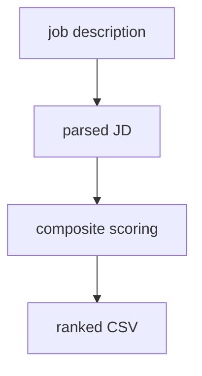

# Canonical `project-spec.md` Format

The single authoring source for a portfolio project. One file holds **machine
metadata** (YAML frontmatter) and the **narrative** (a free-form Markdown body).
Publishing this file with `publish_project_spec` writes the complete project:
frontmatter → metadata fields via create/update, body → Portable Text on
`project.content` (a replace with stable keys).

- Legacy bullet specs are **not supported** — `parse_spec_file` rejects them
  with a migration error. This format is the only spec format.
- `schema_version: 1` + `type: project` in frontmatter are required and mark a
  file as canonical.
- Portable Text on `content` is derived and overwritten on every publish; never
  edit it in Studio. Edit this file and republish.

---

## Template

````markdown
---
schema_version: 1
type: project
slug: candidate-ranking-system
title: Candidate Ranking System
status: completed
shortSummary: Rank 100K+ candidate profiles against a job description into a shortlist CSV.
featured: true
displayOrder: 0
technologies:
  - Python 3.10
  - PyTorch
keyMetrics:
  - "Ranked 100K+ profiles in minutes"
githubUrl: https://github.com/theule-home/candidate-ranking
coverImage: /images/cover.png
coverImageAlt: Pipeline overview
---

## Why I built it {#why-i-built-it}

The problem it solves: ranking hundreds of thousands of candidate profiles.

## System architecture {#system-architecture}



## Engineering decisions {#engineering-decisions}

…

## Interesting challenges {#interesting-challenges}

**Problem:** The golden gate parser choked on 200 MB files.
**Solution:** A streaming chunked reader with a bounded buffer.
**Outcome:** Steady ~40% memory reduction on the largest inputs.

## Results {#results}

- High-precision ranking vs an internal benchmark set.

## Future improvements {#future-improvements}

…
```
````

---

## Frontmatter rules

- Keys are **exactly the Sanity `project` schema field names** (`shortSummary`,
  `githubUrl`, `keyMetrics`, `coverImage`, …). See
  `sanity/schemaTypes/project.ts` (the single source of truth).
- Required: `schema_version: 1`, `type: project`, `title`, `slug`.
- `slug` must be lowercase, URL-safe (`a-z0-9` and hyphens), no leading/trailing
  hyphen.
- `status` is one of: `active`, `completed`, `archived`, `poc`,
  `in-development`.
- Absent fields are **omitted, never empty strings** — do not write empty
  values or "Not set" placeholders.
- Unknown keys are surfaced as warnings; they do not fail the spec.
- `featured` / `displayOrder` are optional; when absent they take the schema
  defaults.
- Image paths (`coverImage`, `screenshots[]`, body images) **must be absolute**
  (start with `/`); relative paths are rejected. They resolve against the
  spec's directory.
- Narrative is **not** a frontmatter field — it is the Markdown body below the
  frontmatter.

## Body rules

- Free-form Markdown; any heading renders (the serializer is schema-free).
- Prefer `##`-level sections; a single `#` title is discouraged (`title` lives
  in frontmatter).
- An explicit `{#id}` on a heading becomes the **published anchor** end-to-end
  (deep links, chat citations, search results). Without a marker, the anchor
  falls back to `generateHeadingId()`.
  - Marker shape: `\s*\{#([a-z0-9][a-z0-9-]*[a-z0-9])\}\s*$`
  - Example: `## Results {#results}` → anchor `#results`.
  - Use stable ids; changing one breaks existing citations.
- Recommended storytelling sections (authoring order = published order):

  | Heading | Purpose |
  |---------|---------|
  | `## Why I built it {#why-i-built-it}` | why / problem / solution |
  | `## System architecture {#system-architecture}` | system diagram |
  | `## Engineering decisions {#engineering-decisions}` | design decisions + rationale |
  | `## Interesting challenges {#interesting-challenges}` | `**Problem:**`/`**Solution:**`/`**Outcome:**` cards |
  | `## Results {#results}` | measurable outcomes |
  | `## Future improvements {#future-improvements}` | what's next |

  Sections beyond these render automatically.
- Narrative markers pass through untouched: `**Problem:**`/`**Solution:**`/
  `**Outcome:**` (challenge cards), `**Q:**`/`**A:**` (FAQ items), mermaid
  fences (```` ```mermaid ````), tables, code fences, blockquotes (callouts),
  and `` images.
- Duplicate explicit `{#id}` markers fail the spec (deterministic error).

## Size & validation caps

- Whole spec file: `SPEC_MAX_CHARS`, default **30,000** chars.
- Serializer input: **60,000** chars per document.
- Unbalanced code fences and non-absolute image paths abort publishing with
  clear errors — nothing partial is written.
- Empty body: if serializing produces zero blocks, the `content` patch is
  skipped entirely (metadata-only project).

## Publishing

```bash
# From the publishing agent: `publish_project_spec <path> mode=create|update`
# mode=create fails if the slug already exists; mode=update patches the existing project.
```

`create_project_from_spec` / `confirm_pending_create` stage and confirm a
spec-driven create from this file; `publish_project_spec` is the one-call
complete-publish path.
